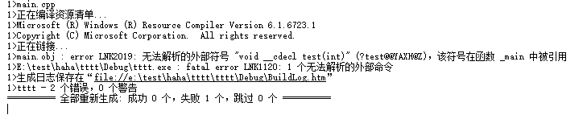
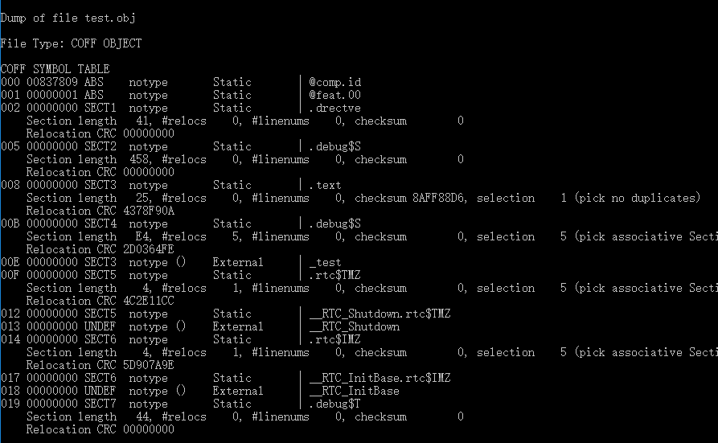
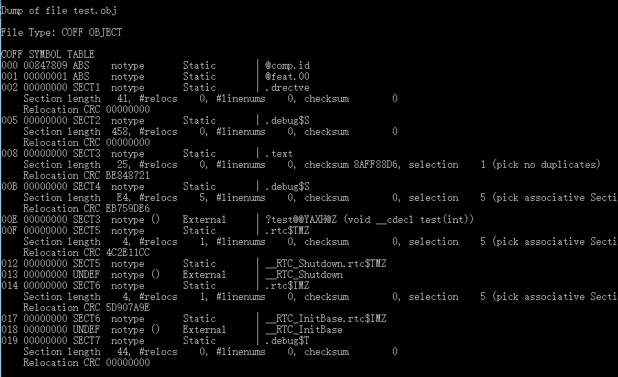
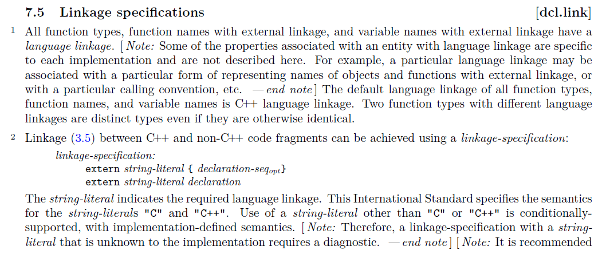

# C和C++混合编译

## 1. 背景

为了工作需要，在抽离一个开源库组件的时候，编译成功链接却失败，查找原因发现测试文件使用的是C++语言，而库的组件使用的是C语言，具体原因记录与此。

## 2. 现场

为了测试，写了一个单独的简单案例：

新建`win32`工程，建立三个文件，分别是`test.c`、`test.h`和`main.cpp`。

main.cpp

```
#include "test.h"

int main()
{
	test(1);
	return 0;
}
```

test.h

```
#ifndef _TEST_H_
#define _TEST_H_

void test(int a);

#endif
```

test.c

```
#include "test.h"

void test(int a)
{

}
```

编译运行：



## 3. 原因

编译成功，链接失败，很显然代码中已经实现了`test`函数，为了查找原因，直接打开vs命令行工具查看一下编译后的符号表都有什么。

进入Debug目录，执行`dumpbin /SYMBOLS test.obj`。



答案很显然，编译`test.c`生成的符号是`_test`，而现在要找的是`void __cdecl test(int)" (?test@@YAXH@Z)`，结果当然是无法找到的。

为了进一步确认答案，将`test.c`改为`test.cpp`，重新编译，查看符号表。



对于C语言生成的符号表和C++语言生成的符号表差距很大，原因无非是C++支持了很多新的功能，原来的符号表生成规则已经无法满足。

> 例如：重载、多态等机制。

为了解决这个问题，C++语言引入了另一种语法来解决这个问题。



## 4. 结论

对于C语言编写的程序来说，未来可能被C语言或者C++语言的用户所使用，大部分解决的方法是：

```
#ifdef __cplusplus
extern "C++" {
#endif

// ...

#ifdef __cplusplus
}
#endif
```

这样做的原因有两个，用`#ifdef`条件语句包裹是因为这种语法对于C语言自身是语法错误，对于C语言调用C语言的函数根本不会存在这个问题，它的目标是使用C++语言的用户，C++语言中支持该语法并且在调用C语言的函数的时候是必须的，原因如上所述。