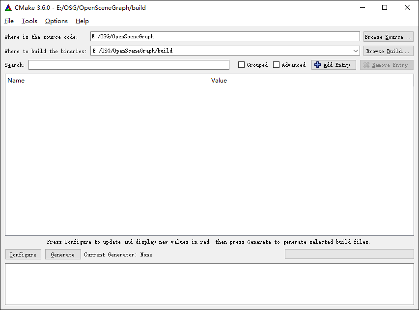
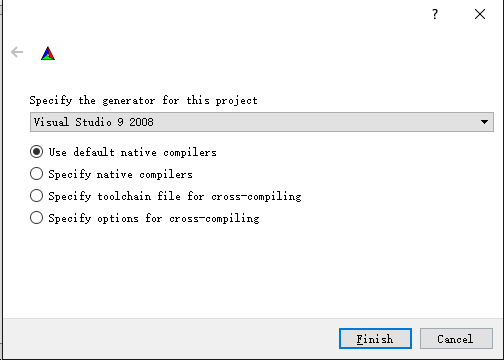
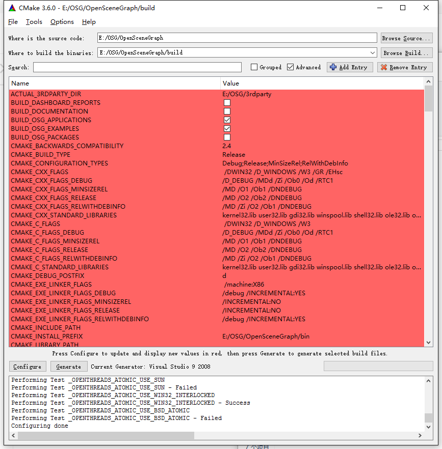
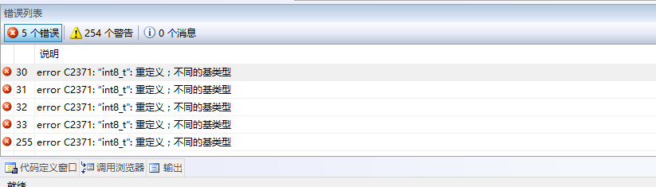

# OSG*(v3.4.0)* 源码编译

### 1. 软件安装

+ 安装vs2008 sp1
+ 安装cmake

### 2. 源码下载

+ 下载OSG源码：[OpenSceneGraph-3.4.0.zip](http://www.openscenegraph.org/index.php/download-section/stable-releases)
+ 下载第三方依赖包：[Windows prebuilt dependency packages](http://www.openscenegraph.org/index.php/download-section/dependencies)
+ 下载OSG资源：[Data Resources](http://www.openscenegraph.org/index.php/download-section/data)

### 3. 目录组织

新建一个目录，用来编译OSG工程。本教程位置：`E:\OSG`

```
---- OSG //根目录
 |
 |-- OpenSceneGraph //OSG源码
 |
 |-- 3rdParty //第三方依赖包
 |
 |-- OpenSceneGraph-Data //OSG资源
```

### 4. 编译源码

打开CMake软件，将`E:\OSG\OpenSceneGraph\CMakeLists.txt`拖到界面上，CMake界面上边的两个textfield会自动填充到该目录。

修正第二个textfield控件的内容，为：`E:/OSG/OpenSceneGraph/build`



点击configure，选择vs2008，finish。



接下来配置所有宏对应的信息。这些宏都是OSG依赖的库，每个库基本上存在三种设置，头文件、Release版本的lib和Debug版本的lib。

如果某些目录没有设置，则用到该库的工程不会被生成，所以尽量配置完全，其实所有依赖的东西都在3rdParty的目录下。只要耐下心选择完毕即可。推荐设置png、jpeg、zip等等。

还有一些宏是设置开关的，如`BUILD_OSG_EXAMPLES`就是设置是否生成OSG的案例工程（推荐勾选）。



推荐仔细查看一遍所有的宏设置是否正确，或者是否是你需要的，如果是则将其值设定好，然后再次点击configure，红色的列表全部消失为止。

点击generate生成工程文件。打开工程进行编译，最终的文件会生成到宏`CMAKE_INSTALL_PREFIX`所对应的参数位置。

### 5. 其他

在编译结束后，很有可能会出现如下错误：



双击定位一下，发现两个工程有下面的错误，一个是osgjs插件，一个是stl插件。简单的注释掉它们，然后重新编译一下即可。


