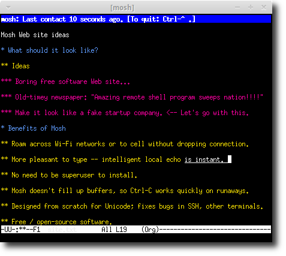
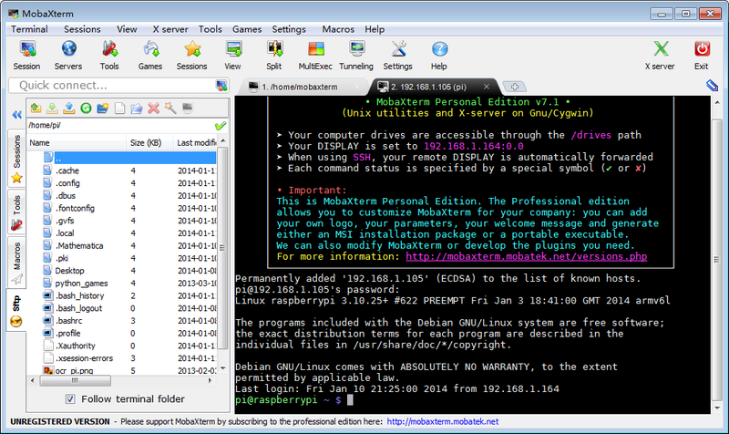

# SSH总是自动断开连接怎么办？

## 1. 前言

SSH是`Secure Shell`的缩写，是一种专为远程登录回话和其他网络服务提供安全的协议，常说的SSH是指实现SSH协议的客户端软件，目前常用的有xshell、putty、secureCRT等，其实大多数使用客户端软件的机器都是windows，因为Linux和mac自带SSH命令，如果偶尔使用一下，完全没有必要下载单独的软件。

在使用SSH客户端的时候，由于某些因素导致连接经常性的断开，特别是在放置一段时间没有操作的情况下，网上搜索有大把的文章教你如何配置各种各样的参数，在折腾n久之后，大多情况下完全解决不了问题。

今天，就来介绍一款SSH的替代品：**Mosh**。

## 2. Mosh

Mosh是基于新的`State Synchronization Protocol(SSP)`协议，运行在UDP上，能同步不同主机对象的状态，加密和认证使用AES-128，当用户在WiFi网络中漫游或者切换到3G网络后，Mosh仍然能够保持连接，在输入命令后能够及时反馈，不会出现恼人的中断或者延迟。经过本人测试，空闲一下午的中断上仍然可以保持连接不断。



Mosh分为服务器和客户单两个软件，服务器安装很简单，在Ubuntu或者Debian下，可以直接执行命令：

```
$ sudo apt-get install mosh
```

大部分的操作系统都有相关的安装包，如果没有可以下载源码进行编译安装，具体可以参考[官网](https://mosh.org/)。

## 3. Mash客户端

刚刚的命令只能确保在服务端安装了软件，但是连接服务端需要使用Mash的客户端软件，在大多数平台上官网都有专门的软件，但是在windows平台上，官方仅仅推荐了两种选择，一个是Cygwin，另一个是Chrome的插件，使用效果都不太理想，这里推荐另一款十全大补丸：**MobaXterm**。

说MobaXterm是神器绝对不为过，支持大量的常用操作，包括多标签和分屏视图、SFTP文件传输、内建X server、支持VNC/RDP/Xdmcp远程桌面、内置多种编码格式、更加友好的串口连接设置等多种功能，绝对是居家旅行的良品，除了本产品免费功能存在一定的限制外。



具体可以到[官方网站](http://mobaxterm.mobatek.net/)下载，最重要的一点该软件整合了Mash协议，可以直接当做Mash客户端使用。

## 4. 其他

Mash协议通讯的时候，因为使用的是UDP，所以需要开放一些端口，默认是从60001起始，请确保类似防火墙的软件不要将其阻挡在外，最后，祝您使用愉快！！！