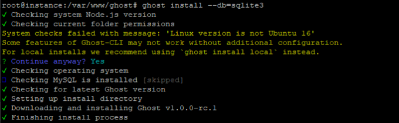
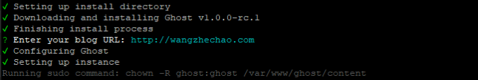
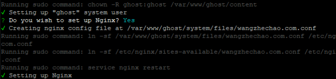
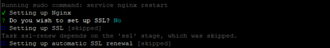
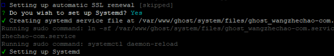
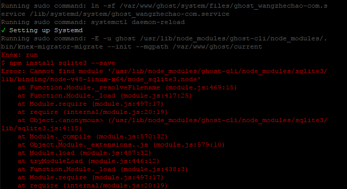
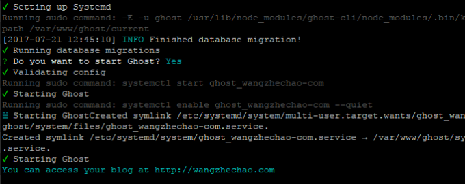

## 1. 前言

又又又又又又一次开始我的博客之旅，主要还是因为前一段时间辞职，想要记录整理一些东西，完成一些过去想去完成，却一直拖延至今的任务。

趁着ghost博客rc版本的发布，再一次踏上写博客的征程。第一篇文章就简要介绍一下这个版本的部署过程，算是开篇之作（*有一个5000多字才写一半的文章被我废弃了*）。

## 2. 准备

ghost博客系统从发布到现在已经有很长一段时间了，对于这个定位轻量级的博客系统很是喜欢，曾经研读过它们的后台代码，收获不少，特别是对于一个nodejs新手来说。

在国内，其实ghost博客并不适合普通站长，因为它部署的成本比wordpress、typecho之类的系统要高很多，不提不易寻找的运行环境，就说它一直在频繁升级这件事情就已经很要命了，现在rc版本的发布，应该算是减低一些门槛吧。

ghost博客系统是基于nodejs开发的，所以部署这个博客你需要一个nodejs的运行环境，显然一般的虚拟主机是无法提供的，这里推荐购买vps。具体的供应商很多，如linode、vultr、DigitalOcean、阿里云、腾讯云、微软、google，大部分512m基础型号的价格都不太贵，每个月大约5$左右的样子，还可以容忍。

除了主机之外，剩下的就是搭建运行环境和域名购买设置等操作，而这篇文章只是单纯的介绍ghost博客系统的环境安装。

官方其实已经给出了[安装说明](https://docs.ghost.org/v1.0.0/docs/installing-ghost-via-the-cli)，不过可能是因为rc版本的缘故，目前仅支持**Ubuntu 16.04**，其他版本按照说明部署可能存在问题。

## 3. 流程

本篇文章操作的vps系统环境是Debian9，数据库没有使用MySQL，因为安装最新版本的MySQL至少需要系统内存1G以上，再加上相对于MySQL而言，我更喜欢只有一个文件的sqlite，简洁方便。

### 3.1 安装nginx

首先安装nginx，主要用来做反向代理。

```
sudo apt-get install nginx
```

如果系统存在防火墙，需要开端口。

```
sudo ufw allow 'Nginx Full'
```

这句话的主要功能是允许http（80）、https（443）连接通过防火墙。如果存在其它网络设置，请将tcp的80和443的端口开放，避免网站部署成功却仍然无法访问的尴尬局面。

### 3.2 安装Nodejs

目前ghost系统对于Nodejs的版本有一定的要求，推荐使用Node 6。

```
curl -sL https://deb.nodesource.com/setup_6.x | sudo -E bash -
sudo apt-get install -y nodejs
```

### 3.3 安装Ghost-CLI

Ghost命令行工具，用来设置ghost的运行环境。

```
sudo npm i -g ghost-cli
```

安装成功后，在`/var/www`目录下建立一个ghost文件夹。用来放置ghost系统的相关文件。

```
sudo mkdir /var/www/ghost
```

进入该文件夹。

```
cd /var/www/ghost
```

安装使用sqlite数据库的Ghost系统。

```
ghost install --db=sqlite3
```

## 3.4 Ghost系统的相关配置

如果运行的操作系统不是Ubuntu 16，程序会提示你是否继续，这里输入Yes继续。



提示输入blog的URL，这里输入你的域名即可。



提示是否希望设置Nginx，这里输入Yes。



提示是否设置SSL，因为博客暂时没有准备使用https，所以输入No。



提示是否设置Systemd守护进程，这里输入Yes。



> 注意：在这里可能会报错，提示找不到node_sqlite3.node模块，让你输入命令`npm install sqlite3 --save`安装。
>
> 
>
> 解决的办法是进入ghost-cli目录，重新安装sqlite3模块。
>
> ```
> cd usr/lib/node_modules/ghost-cli
> npm install sqlite3 --save
> ```
>
> cd命令后面接的是错误提示信息的ghost-cli目录，如果安装成功，可以进入目录确认一下node_sqlite3.node是否真的存在，如果存在代表安装成功，可以切换到原来的`/var/www/ghost`目录继续接下来的操作。
>
> *提示：如果安装成功不知如何继续，可以删除ghost目录的所有东西，重新开始。*

如果一切顺利，会提示是否重启Ghost系统，直接输入Yes，命令行会提示Ghost系统启动成功，这时候可以使用上面设置的URL访问博客了。



## 4. 设置nginx

博客设置好后，可以正常访问，但是如果前面加上www仍然无法访问，这里需要设置nginx的配置文件，将www.wangzhechao.com跳转到wangzhechao.com即可。

```
server {
   server_name www.wangzhechao.com;
   return 301 $scheme://wangzhechao.com$request_uri;
}
```

运行`service nginx reload`重新加载配置。