# Yaffs文件系统移植

## 1. 前言

### 1.1 目的

本文主要的目的是在无操作系统的ARM板移植Yaffs文件系统，文章中主要涉及Flash硬件简介、操作手册阅读、NAND Flash驱动的编写和Yaffs文件系统移植几个部分。文章不会涉及过多硬件和引脚的知识，而是把焦点放到介绍相关软件代码的编写工作，但为了便于理解，会简单的介绍Flash硬件的部分原理，以及源码和硬件的对应关系。

### 1.2 目标读者

阅读此文你需要了解并掌握ARM程序的编写过程，并且移植或编写过ARM板的程序，如果是在无操作系统的ARM板进行过代码编写，效果更佳。对于在Linux下移植Yaffs文件系统，该文章只具备参考价值。

### 1.3 缩略词

| 缩写    | 全称                            | 含义             |
| ----- | ----------------------------- | -------------- |
| ARM   | Acorn RISC Machine            | 低功耗成本的RISC微处理器 |
| Yaffs | Yet Another Flash File System | 一种嵌入式文件系统      |
| Linux | Linux                         | 开源操作系统         |
| Flash | Flash Memory                  | 存储芯片的一种        |
| ROM   | Read Only Memory              | 只读存储器          |
| DARM  | Dynamic Random Access Memory  | 动态随机存储器        |
| SLC   | Single Level Cell             | 单阶存储单元         |
| MLC   | Multi Level Cell              | 多阶存储单元         |
| TLC   | Triple Level Cell             | 三阶存储单元         |
| OOB   | Out of Band                   | 空闲区            |
| ECC   | Error Correction Code         | 错误校验码          |
| BBT   | Bad Block Table               | 坏块表            |
| BBM   | Bad Block Management          | 坏块管理           |

## 2. Flash硬件介绍

### 2.1 简介

Flash是一种数据存储芯片，全名叫做Flash Memory，是一种允许在操作中被多次擦或写入的存储器。存储设备的种类很多，Flash属于非易失性存储设备，即使断电也不会丢失数据，除了Flash，该类设备还包括硬盘、ROM等。与此相对的是易失性存储设备，断电后数据丢失，例如常见的内存。

### 2.2 Flash的种类

常见的Flash有两种类型：NAND Flash 和 NOR Flash。

NOR Flash 的成本较高，有类似DARM的地址总线，读取数据的方式与ARM读取数据相似，允许随机读写，不容易出错，容量较小，适用于存储少量代码。

NAND Flash的成本较低，通过IO接口发送命令和地址，是区块性存储设备，容量较大，写入读取都是以页面为单位，相对容易出错，需要软件或者硬件的数据校验算法结合使用，提高数据的准确性。

### 2.3 SLC、MLC和TLC

闪存将数据存储在由浮闸晶体管组成的记忆单元数字内，在单阶存储单元（Single-level cell, SLC）设备中，每个单元只存储1比特的信息。而多阶存储单元（Multi-level cell, MLC）设备则利用多种电荷值的控制让每个单元可以存储1比特以上的数据。TLC（Triple-Level Cell, TLC）三阶存储单元在架构上和MLC类似，但每个存储单元存储3个信息比特。


在NAND Flash设计中，会有一条命令用来读取芯片的ID。通过ID可以查看Flash芯片自身的一些信息，例如下表是MX30LF1G08AA芯片的命令回复：

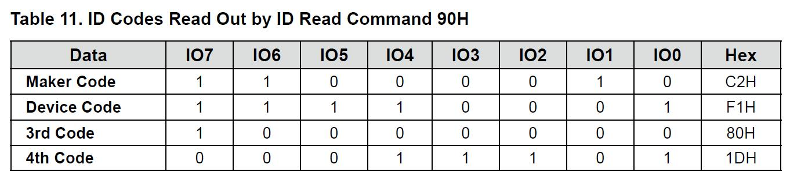

该芯片可以通过解析第三个字节了解具体是什么存储单元。

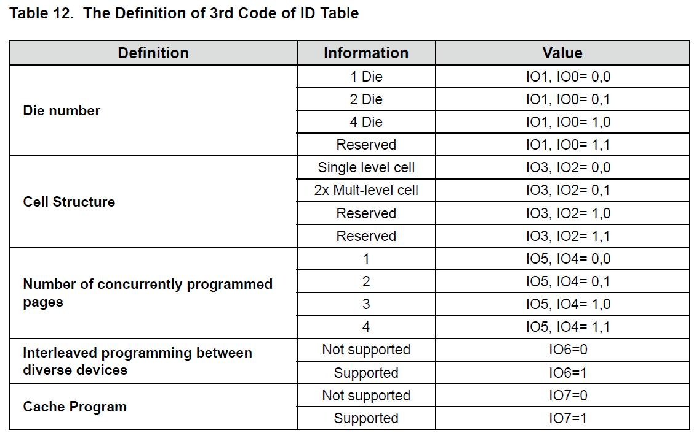

第三个字节，第二位和第三位如果是00代表SLC，如果是01代表MLC。

### 2.4 NAND Flash逻辑架构

一块NAND Flash可能内部包含多个chip，每个chip可能有多个plane，每个plane有多个block，每个block又包含多个page，每个page就是基本的读写单位，每个page内部除了包含数据区，还包括额外的空闲区，也叫做OOB（out of boundary）区。

一般NAND Flash芯片只包含一个chip，每个chip也只包含一个plane。

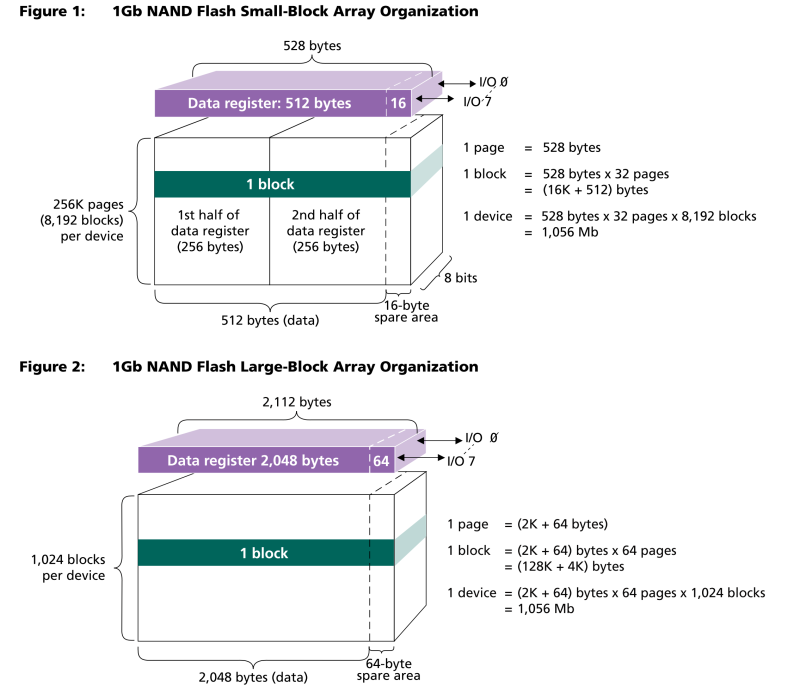

上图就是两种flash芯片的结构示意图。如果想要知道手头芯片的具体参数，可以通过芯片的名称或者datasheet手册进行查看，也可以通过获取ID信息动态解读，例如MX30LF1G08AA芯片读取ID命令的第四个字节：

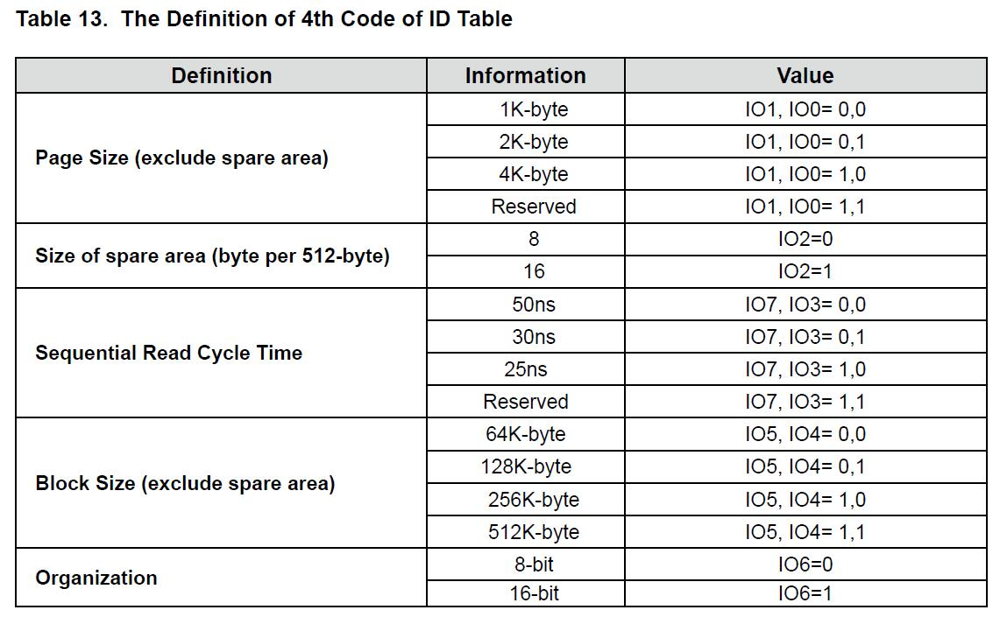

#### 2.4.1 Block（块）

一个NAND Flash（chip，芯片）由多个Block组成，每个块一般是64KB、128KB、256KB、512KB等等。**Block是NAND Flash芯片擦除操作的基本单位（最小单位）**。

#### 2.4.2 Page （页）

一个Block内部包含多个Page，Page容量大于2KB称为large page，目前比较常见。**Page是读写操作的基本单位**。写操作在Flash中通常叫做编程。

#### 2.4.3 OOB/Spare Area/Redundant Area（空闲区）

每一个页除了对应的数据区还有一块区域，叫做空闲区（spare area）/冗余区（redundant area），而在Liunx系统中，一般叫做OOB（out of band），这个区域主要的目的是因为NAND Flash硬件特性所决定的，因为NAND Flash芯片在读写时候容易出错，为了保证数据的正确性，一般使用OOB区域存放ECC等检测和纠错机制相关的数据，因为芯片只是提供空间，并没有规定该区域数据的存放规范，在不同的系统中，该区域的数据存在一定的差异，但是总体来说，有如下几种用途：

+ 标记是否为坏块。
+ 存储ECC数据。
+ 存储文件系统相关的数据结构。

### 2.5 NAND Flash特性

NAND Flash有很多特性，这些特性的存在一定程度上影响了Flash使用的方法。

#### 2.5.1 读写特性

NAND Flash芯片读写的单位是页，擦除的单位是块。由于芯片的物理特性，内部存储的数据只能从1变为0，擦除动作是将所有的数据设置为1，所以擦除后读取数据全部是0xFF，擦除的过程其实是充电的过程，有电代表1。数据写入的过程就是放电的过程，将1变为0。所以当你在已经为0的位置再次写入数据，并不会改变原有的值。例如你在某页的第一个字节位置写入0x00，当你再次在该页第一个字节写入0x11是不会生效的，为了再次写入0x11，你需要清除该页的数据，将所有数据都变为0xFF，然后再次写入0x11。

但实际并没有那么简单，因为擦除操作的基本单位为块，所以你需要先将块中的所有数据放到一个地方暂存，然后擦除该块，再将原有的其他地方的数据写入，否则其他页的数据将会丢失，好的文件系统会有一个具体的算法策略来考虑是否“值得”执行擦除命令。

#### 2.5.2 设备耗损

因为NAND Flash是消耗品，它存在一定量的抹写循环的次数限制（大多数商业性SLC闪存确保第一块有十万次的抹写能力），所以如果只是普通的操作页面读写，会造成某块的使用频率突出，易造Flash的坏块，降低其使用寿命。为了降低损耗，有两种技术手段。损耗平衡（wear leveling）和坏块管理（Bad Block Management，BBM）。前者是通过某种算法策略将读写次数均匀分布到每个块上，类似于“负载均衡”，后者是将现有的坏块通过列表的方式存储起来，避免以后造成对坏块的读写操作造成数据的丢失，一般坏块表保存到第一块中，也有存储在OOB中的方式。

#### 2.5.3 位反转

NAND Flash的位反转特性（Bit Fliping）是由于硬件自身的原理造成的，会导致偶尔的情况出现位反转的现象，可能是读写的干扰，也可能是周围环境的因素造成原有的某位从0变为1或者从1变为0。

这种情况有两种类型：

+ 一种是物理单元的数据是正确的，只在读取出来的数据某位发生了变化，和物理单元保存的数据不一致。
+ 一种是物理单元的数据已经是错误的，即使将读取出的数据通过某种方式进行了修正，物理单元本身的数据还是错误的，只有通过重新擦除写入才有可能修正。

这两种方式的错误在一定程度上都可以通过算法来进行修正，常用的算法就是ECC。

#### 2.5.4 坏块

由于NAND Flash的工艺问题，再生产和使用过程中会出现坏块（Bad Block）。坏块的稳定性是无法保障的，换句话说，坏块不能保证读取和写入数据的正确性。

坏块可以分为两类：一种是出厂时候就存在的坏块，被称为固有坏块，在出厂的时候会在OOB做对应的标记。另一种是使用过程中产生的坏块，这就需要操作Flash的用户来进行标记，防止再次写入丢失数据。

坏块的标记位对于不同的芯片有可能存在差异，在MX30LF1G08AA芯片中，判断坏块的方法是查看该块的第一页和第二页的OOB区域的第一个字节。如果存在非0xFF数据，则说明是坏块。

对于刚出厂的芯片，最好不要直接进行擦除操作，因为直接擦除操作有可能破坏原有OOB中的坏块标记。最好在擦除之前记录现有的坏块，擦除后重新做标记。

常见的标记方法两种：

+ 直接存放一张BBT（坏块表）到某些地方，记录当前的坏块。
+ 使用手册标记的位置，设置坏块标记。对于MX30LF1G08AA芯片，可以将坏块的第一页和第二页的OOB区域的第一个字节设置为非0xFF。这样每次检查该数据，确认是否为坏块。

## 3. datasheet 操作手册简介

对于NAND Flash驱动的编写离不开datasheet操作手册，这里简单的介绍一下操作手册几个重要的图例，便于软件开发使用，实际开发过程中可以通过搜索引擎下载案例研究使用方式。下面所有内容的介绍都是基于MX30LF1G08AA芯片的操作手册。

### 3.1 引脚说明

下图为芯片的引脚介绍：

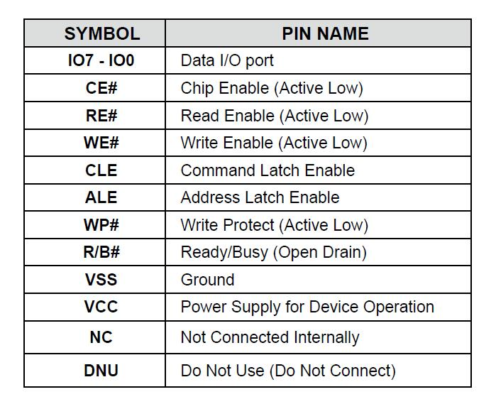

+ IO7 - IO0 用于和芯片交互的数据输入输出区。8个引脚，每次可以传递一个字节。
+ CE# 芯片使能。在操作NAND Flash芯片前，需要通过该引脚进行选中。
+ RE# 读使能。在读取数据前，需要使RE#有效。
+ WE# 写使能。在写入数据前，需要使WE#有效。
+ CLE 命令锁存使能。在输入命令前，要先在模式寄存器中设置CLE使能。
+ ALE 地址锁存使能。在输入地址前，要先在模式寄存器中设置ALE使能。
+ WP# 写保护。
+ R/B# Ready/Busy。在发送完编程/擦除命令后，检测操作是否完成。使能表示Busy。
+ VSS 接地。
+ VCC 电源。
+ NC 未连接。
+ DNU 未使用。

*如果看到字母上边有一个横线或者字母后面有个#标记，代表着低电平有效。使能就是控制信号的输入输出，是一个动词，应为enable翻译得出，基本等同于打开，之所以叫使能而不是特意说是设置高电平或是低电平，是因为每个引脚的情况不同，有些低电平有效，有些高电平有效，激活它们并不是固定的电平信号，所以直接叫使能。CE#使能代表使用低电平进行激活开启*。

### 3.2 命令列表

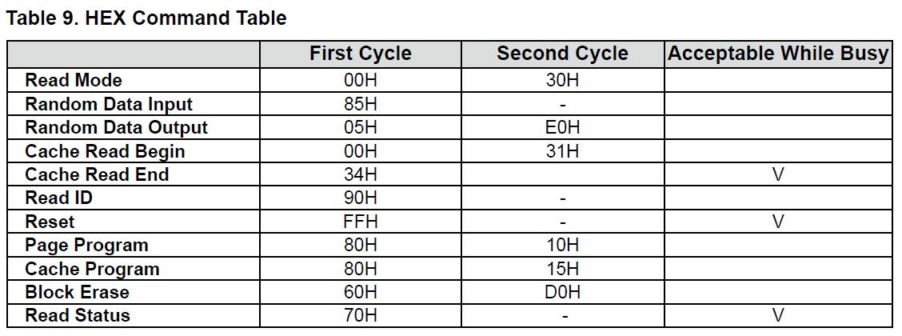

如上图所示，对于Flash的读写命令都需要两个周期，因为IO口只有8位，所以一次只能传输一个字节。读写命令的顺序一般是先发送第一个命令，然后输入对应的地址或者数据，然后在发送第二命令，具体的操作流程需要查看时序图。

### 3.3 波形图阅读

阅读datasheet中的波形图是比较重要的，从中可以得到引脚的设置方式，下面以芯片读取操作的时序图为例。

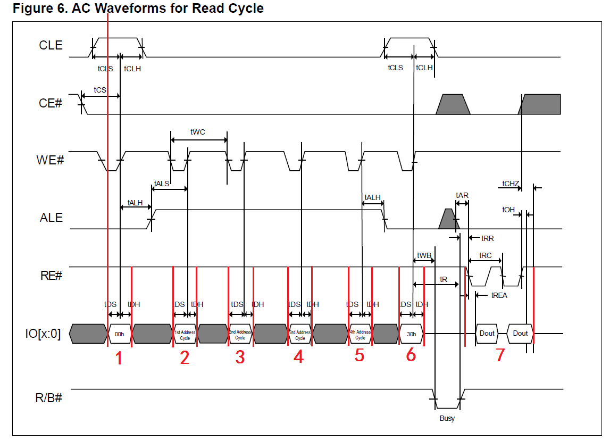

*注：图上的红线是为了说明专门画的，非手册自带。*

图片的x轴代表时间，从左到右递增。y轴代表各个引脚的状态。查看时序图左边的第一条红线，代表读取命令发送之前的那个时刻，在这一刻各个引脚的状态代表着在编程时期需要设置引脚的值。

在这一刻（00h命令输入前引脚设置），从上到下：

+ CLE 高电平，使能有效。代表接下来IO引脚传入的是命令数据。
+ CE# 低电平，使能有效。代表即将操作芯片。
+ WE# 低电平，使能有效。代表即将写入操作。
+ ALE 低电平，禁能无效。因为接下来输入的是命令不是地址。
+ RE# 高电平，禁能无效。因为暂时没有都操作。
+ IO[x:0] 即将输入命令00h。
+ R/B# 高电平，禁能表示无效，代表系统就绪状态。


根据命令列表中读取操作的命令需要两个周期，分别是00h和30h。在时序图的IO引脚那行有所体现，图中数字1代表00h命令输入，2、3、4、5代表地址输入，6代表30h命令输入，命令输入完，R/B#引脚进入Busy状态，在数字7的时段可以接收IO引脚输出的数据。

### 3.4 地址计算

不管是读取还是写入，都需要通过IO口向NAND Flash传入地址信息，在MX30LF1G08AA芯片中，地址可以用四个字节表示，在操作手册的最开始有介绍芯片的一些特性：

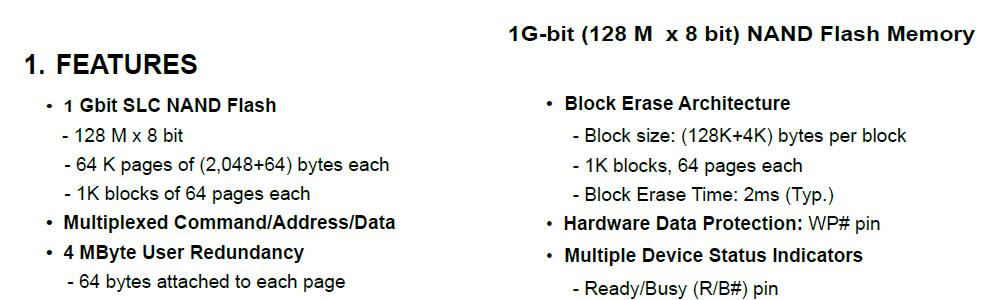

文档中描述，该芯片大小为1G-bit，即128M，是一款 SLC NAND Flash芯片。芯片内部包含1K Blocks，每Block包含64 Pages，每Page 包含 2048 bytes和64 bytes OOB。这些信息除了可以在文档中查看，还可以通过读取ID命令获得。

有了这些信息，就可以计算某处的地址信息。在操作手册中有地址周期的IO输入描述：

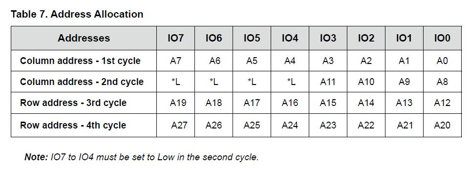

地址分配为四个周期，对应四个字节，前两周期传入列地址，后两周期传入行地址。**列地址一共12位，表示页内偏移。行地址一共16位，表示页号。**

如果想要访问第x块中的第y页内的z字节处，此时可以这样计算：

```
column address - 1st cycle = z & 0x000000FF;
column address - 2nd cycle = (z & 0x00000F00) >> 8;
row address - 3rd cycle = (x * 64 + y) & 0x000000FF;
row address - 4th cycle = ((x * 64 + y) & 0x0000FF00) >> 8;
```


## 4. 驱动程序编写

### 4.1 NAND Flash 控制器

一般在使用NAND Flash芯片的时候都是集成到某个硬件设备之上，而编写NAND Flash的驱动程序并不是运行在NAND Flash芯片内部，而是运行其他芯片上，对于嵌入式设备来说常见的就是ARM芯片，对于不同的厂商，ARM芯片的能力各不相同，不过大部分都会集成外部存储控制器（EMC）。而如今编写的程序主要控制的是该芯片的运行。如果想要开发某Flash芯片的驱动，可以参考主控芯片的官网例子，然后根据Flash芯片的操作手册，调整程序设置。

### 4.2 代码实现

编写NAND Flash驱动需要知道要实现哪些接口，常见的操作有读取数据、写入数据、擦除数据、读取状态、重置等等。具体可以参考ONFI规范或者根据具体的程序需求进行编写。

根据MX30LF1G08AA芯片的操作手册，下面使用代码描述一下常见的操作。

#### 4.2.1 NandFlash_Init 初始化

该接口主要是初始化NAND Flash控制器的一些引脚设置，根据不同的外部存储控制器（EMC），设置会有不同，具体需要查看芯片相关文档。

#### 4.2.2 NandFlash_Reset 重置命令

根据操作文档上的波形图：

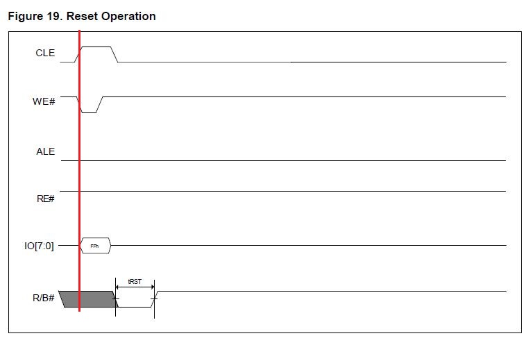

使能CLE和WE#，写入数据FFh。转换为代码：

```C
void NandFlash_Reset( void )
{
	volatile uint8_t *pCLE;

	/* Reset NAND FLASH  through NAND FLASH command */
	pCLE = MX30LF1G_CLE;
	*pCLE = MX30LF1G_RESET;  //#define MX30LF1G_RESET 0xFF

	TIM_Waitms(2);
}
```

`TIM_Waitms`表示等待2ms，具体等待时间可以查看操作手册：

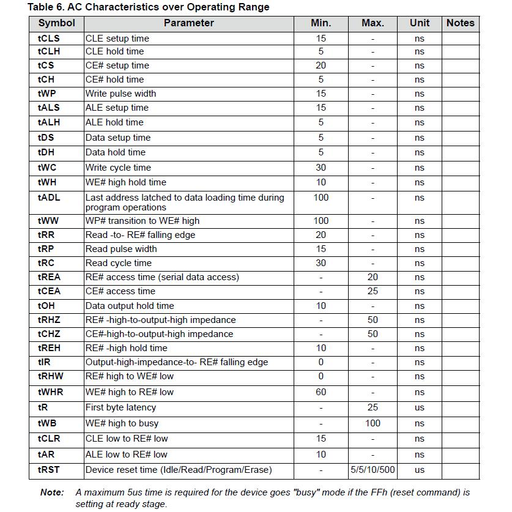


#### 4.2.3 NandFlash_ReadId 读取设备ID

根据操作手册的波形图：

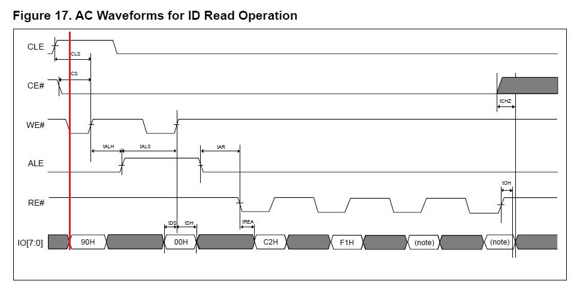

使能CLE、CE#、WE#，禁能ALE、RE#。代码如下：

```C
uint32_t NandFlash_ReadId( void )
{
	uint8_t a, b, c, d;
	volatile uint8_t *pCLE;
	volatile uint8_t *pALE;
	volatile uint8_t *pDATA;

	pCLE  = MX30LF1G_CLE;
	pALE  = MX30LF1G_ALE;
	pDATA = MX30LF1G_DATA;

	*pCLE = MX30LF1G_READ_ID;
	*pALE = 0;

	a = *pDATA;
	b = *pDATA;
	c = *pDATA;
	d = *pDATA;

	return ((a << 24) | (b << 16) | (c << 8) | d);
}
```

#### 4.2.4 NandFlash_ReadStatus 获取状态信息

根据操作手册波形图：

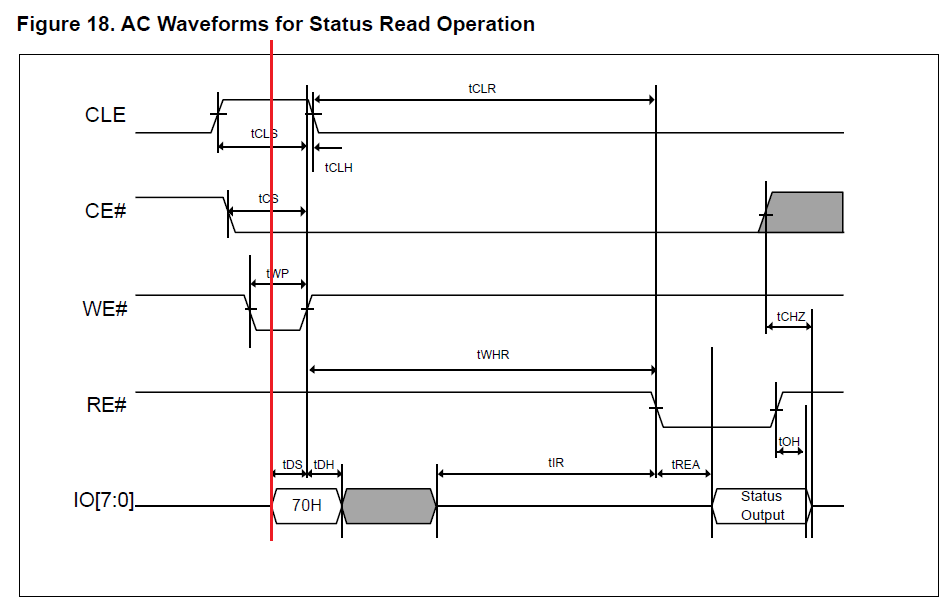

使能CLE、CE#、WE#，禁能RE#。发送完命令后可以直接从IO口读取状态值，具体可以根据操作手册中的状态表进行判断当前状态：

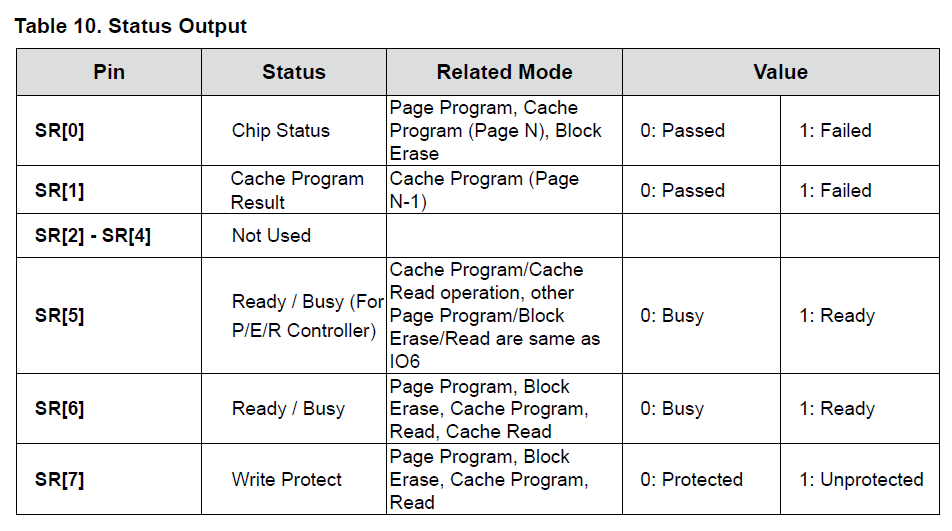

参考代码如下：

```C
Bool NandFlash_ReadStatus(uint32_t Cmd)
{
	volatile uint8_t *pCLE;
	volatile uint8_t *pDATA;
	uint8_t StatusData;

	pCLE  = MX30LF1G_CLE;
	pDATA = MX30LF1G_DATA;

	*pCLE = MX30LF1G_READ_STATUS;

#if 0
	while ( (*pDATA & 0xC0) != 0xC0 );
#else
	/* Wait until bit 5 and 6 are 1, READY, bit 7 should be 1 too, not protected */
	/* if ready bit not set, it gets stuck here */
	while ( (*pDATA & 0xE0) != 0xE0 );
#endif

	StatusData = *pDATA;

	switch (Cmd)
	{
		case MX30LF1G_PROGARM_FIRST_CYCLE:
		case MX30LF1G_ERASE_FIRST_CYCLE:
		  	if (StatusData & 0x01)	 /* Erase/Program failure(1) or pass(0) */
				return(FALSE);
		  	else
				return(TRUE);

		case MX30LF1G_READ_FIRST_CYCLE:	 /* bit 5 and 6, Read busy(0) or ready(1) */
		  	return(TRUE);

		default:
		  	break;
	}

	return(FALSE);
}
```


#### 4.2.5 NandFlash_BlockErase 块擦除

根据操作手册波形图：

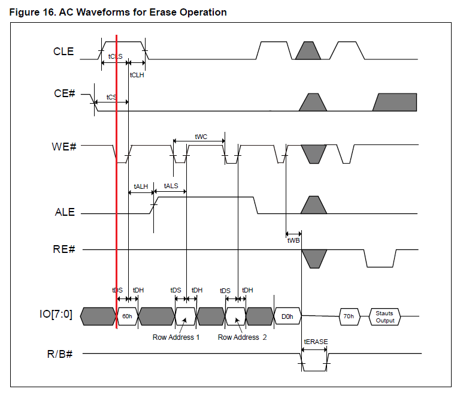

使能CLE、CE#、WE#，禁能ALE、RE#。

```C
Bool NandFlash_BlockErase( uint32_t blockNum )
{
	volatile uint8_t *pCLE;
	volatile uint8_t *pALE;
	uint32_t rowAddr;

	pCLE  = MX30LF1G_CLE;
	pALE  = MX30LF1G_ALE;

	rowAddr = blockNum * NANDFLASH_PAGE_PER_BLOCK;
	
	*pCLE = MX30LF1G_ERASE_FIRST_CYCLE;

	*pALE = (uint8_t)(rowAddr & 0x00FF);			/* column address low */

	*pALE = (uint8_t)((rowAddr & 0xFF00) >> 8);		/* column address high */

	*pCLE = MX30LF1G_ERASE_SECOND_CYCLE;

	NandFlash_WaitForReady();

	return(NandFlash_ReadStatus(MX30LF1G_ERASE_FIRST_CYCLE));
}
```

*NandFlash_WaitForReady()函数是获取Flash芯片R/B#引脚的状态，并等待其就绪。*

#### 4.2.6 NandFlash_PageReadFromAddr 读取操作

根据操作手册波形图：

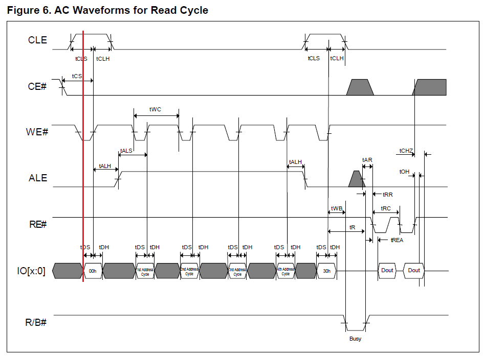

使能CLE、CE#、WE#，禁能ALE、RE#。

```C
int NandFlash_PageReadFromAddr(uint32_t blockNum, uint32_t pageNum,
        uint32_t addrInPage, uint8_t* bufPtr, uint32_t size)
{
    volatile uint8_t *pCLE;
    volatile uint8_t *pALE;
    volatile uint8_t *pDATA;
    uint32_t i, curColumm, curRow;    


    pCLE  = MX30LF1G_CLE;
    pALE  = MX30LF1G_ALE;
    pDATA = MX30LF1G_DATA;

    curColumm = addrInPage;
    curRow = blockNum * NANDFLASH_PAGE_PER_BLOCK + pageNum;

    *pCLE = MX30LF1G_READ_FIRST_CYCLE;

    *pALE =  (uint8_t)(curColumm & 0x000000FF);			/* column address low */

    *pALE = (uint8_t)((curColumm & 0x00000F00) >> 8);   /* column address high */

    *pALE = (uint8_t)((curRow & 0x00FF));				/* row address low */

    *pALE = (uint8_t)((curRow & 0xFF00) >> 8);			/* row address high */

    *pCLE = MX30LF1G_READ_SECOND_CYCLE;

    NandFlash_WaitForReady();

    //Get data from the current address in the page til the end of the page
    for ( i = 0; i < (NANDFLASH_PAGE_FULL_SIZE - curColumm); i++ )
    {
        bufPtr[i] = *pDATA;

        if((i + 1) >= size)
            break;
    }

    // Ok, return
    return i;
}
```

#### 4.2.7 NandFlash_PageProgram 页面编程

根据操作手册波形图：

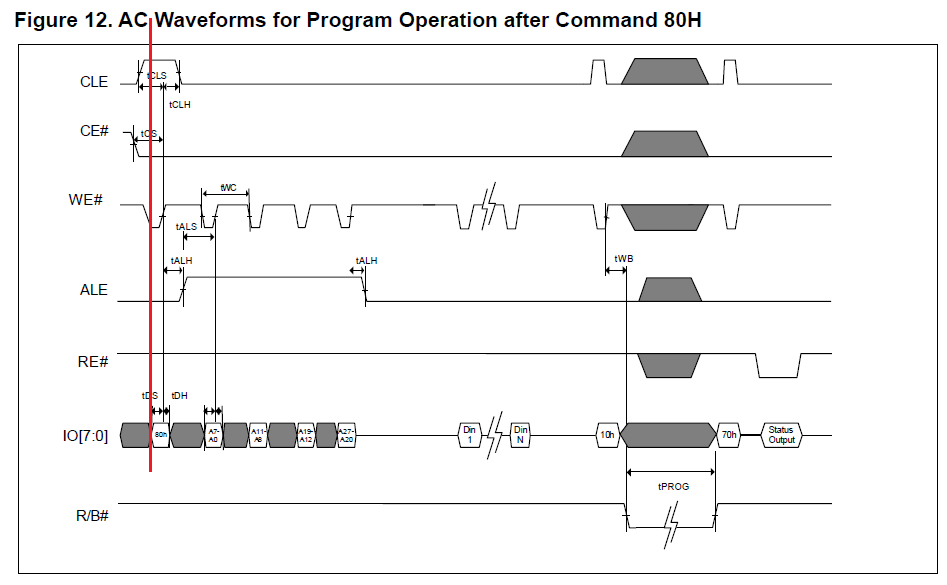

使能CLE、CE#、WE#，禁能ALE、RE#。

```C
Bool NandFlash_PageProgram( uint32_t blockNum, uint32_t pageNum, uint8_t *bufPtr, Bool bSpareProgram  )
{
    volatile uint8_t *pCLE;
    volatile uint8_t *pALE;
    volatile uint8_t *pDATA;
    uint32_t i, curRow, curColumm;
    uint16_t programSize = NANDFLASH_RW_PAGE_SIZE;

    pCLE  = MX30LF1G_CLE;
    pALE  = MX30LF1G_ALE;
    pDATA = MX30LF1G_DATA;

    curColumm = 0;
    curRow = blockNum * NANDFLASH_PAGE_PER_BLOCK + pageNum;
    
    if(bSpareProgram)
        programSize = NANDFLASH_PAGE_FULL_SIZE;
    
		
    *pCLE = MX30LF1G_PROGARM_FIRST_CYCLE;

    *pALE =  (uint8_t)(curColumm & 0x000000FF);			/* column address low */

    *pALE = (uint8_t)((curColumm & 0x00000F00) >> 8);   /* column address high */

    *pALE = (uint8_t)((curRow & 0x00FF));				/* row address low */

    *pALE = (uint8_t)((curRow & 0xFF00) >> 8);			/* row address high */

    for ( i = 0; i < programSize; i++ )
    {
        *pDATA = bufPtr[i];
    }

    *pCLE = MX30LF1G_PROGARM_SECOND_CYCLE;

    NandFlash_WaitForReady();

    return( NandFlash_ReadStatus( MX30LF1G_PROGARM_FIRST_CYCLE ) );
}
```

#### 4.2.8 NandFlash_ValidBlockCheck 坏块检测

根据操作手册中的坏块检测流程：

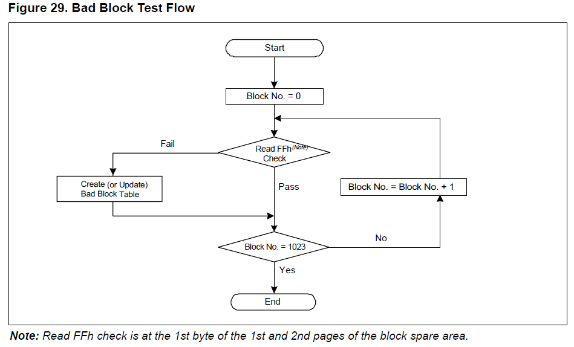

可以通过读取第一页和第二页OOB区域的第一个字节进行判断。

```c
Bool NandFlash_ValidBlockCheck( void )
{
	uint32_t block, page, badBlock;
	Bool retValue = TRUE;

	uint8_t data = 0;
	badBlock = 0;

	for ( block = 0; block < NANDFLASH_NUMOF_BLOCK; block++ )
	{
		for ( page = 0; page < 2; page++ )
		{
			/* Check column address 2048 at first page and second page */
			NandFlash_PageReadFromAddr(block, page, NANDFLASH_INVALIDBLOCK_CHECK_BIT, &data, 1);

			if(data != 0xFF)
			{
				// found invalid block number, mark block number in the invalid
				// block table
				InvalidBlockTable[block] = 1;

				//At least one block is invalid
				retValue = FALSE;
				
				badBlock++;
				
				break;
			}
		}
	}

	return(retValue);
}
```

#### 4.3.9 NandFlash_MarkBadBlock 坏块标记

坏块标记和坏块检测类似，只不过标记是写数据，检测是读数据。在系统中为了防止重读读取，提升效率，可以考虑在内存中存放一张坏块表，系统启动时，将其读入内存。

在标记坏块时，更新Flash的同时，同步更新坏块表。查看某块正常与否，可以直接查看内存中的坏块表。

```c
Bool NandFlash_IsBadBlock(uint32_t blockNum)
{
	if(blockNum >= NANDFLASH_NUMOF_BLOCK) {
		return TRUE;
	}

	if(InvalidBlockTable[blockNum] == 1) {
		return TRUE;
	}

	return FALSE;
}
```

## 5. 移植Yaffs文件系统

### 5.1 Yaffs文件系统简介

Yaffs（Yet Another Flash File System）是专门为NAND Flash设计的文件系统，在GPL协议下发布，适用于大容量的存储设备的嵌入式系统，主要由Aleph One公司的Charles Manning开发。目前Yaffs文件系统有两个版本Yaffs1和Yaffs2。

一般来说对于small page的NAND Flash芯片，Yaffs1支持更好，对于现代大部分都是big page 的NAND Flash芯片的情况下，Yaffs2更加常用。

Yaffs文件系统针对NAND Flash特性做了很多针对性的优化，提高性能，延长芯片的使用寿命。其移植性非常好，对于没有操作系统的设备上，可以直接使用。

Yaffs文件系统整体架构如下：

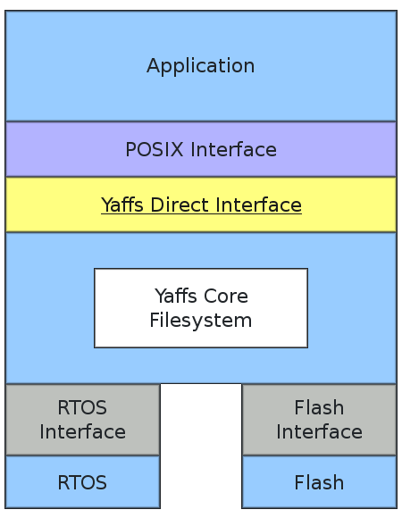

文件系统在整个应用体系中属于中间层，对下和操作系统、Flash对接，对上和应用程序对接。

### 5.2 移植准备

移植Yaffs文件系统，首先下载其源码，可以访问官网：[www.yaffs.net](www.yaffs.net)。

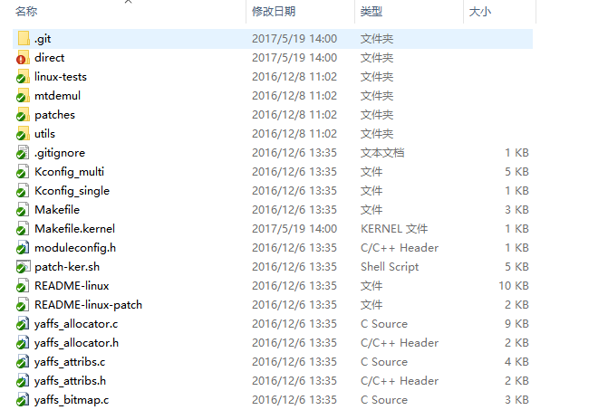

因为进行裸机移植，所以将direct文件夹下的文件加入到工程中。如果想要真正的使用Yaffs文件系统，还需要做几件事情：

1. 建立Yaffs配置文件。
2. 实现Yaffs文件系统和操作系统的交互接口。
3. 实现Yaffs文件系统和NAND Flash驱动的交互接口。
4. 实现Yaffs文件设备挂载函数。

### 5.3 移植操作

#### 5.3.1 建立Yaffs配置文件

建立配置文件之前，需要先确认编译环境提供什么库函数，C语言库函数是否提供完全，主要是字符串操作相关的函数。

在direct目录下存在一个handle_common.sh，在移植文件系统前，可以执行该脚本，替换源码中的相关函数为yaffs_指定的函数。

```sh
if [ "$1" = "copy" ] ; then
set -e -x
	for i in $YAFFS_COMMON_SOURCES ; do
		sed ../$i \
		-e "s/strcat/yaffs_strcat/g" \
		-e "s/strcpy/yaffs_strcpy/g" \
		-e "s/strncpy/yaffs_strncpy/g" \
		-e "s/strnlen/yaffs_strnlen/g" \
		-e "s/strcmp/yaffs_strcmp/g" \
		-e "s/strncmp/yaffs_strncmp/g"\
		-e "s/loff_t/Y_LOFF_T/g" \
		 >$i
	done
elif [ "$1" = "clean" ] ; then 
	for i in $YAFFS_COMMON_SOURCES ; do
		rm -rf $i
	done
else
	echo "please specify copy or clean"
	exit 1
fi
```

运行命令：

```sh
cd yaffs2/direct
./handle_common.sh copy
```

打开ydirectenv.h文件，会发现yaffs_开头的函数公用函数都在这里进行替换，如果想要修改某些东西，可以在该文件中修改。

```C++
#define yaffs_strcat(a, b)	strcat(a, b)
#define yaffs_strcpy(a, b)	strcpy(a, b)
#define yaffs_strncpy(a, b, c)	strncpy(a, b, c)
#define yaffs_strnlen(s, m)	strnlen(s, m)
#ifdef CONFIG_YAFFS_CASE_INSENSITIVE
#define yaffs_strcmp(a, b)	strcasecmp(a, b)
#define yaffs_strncmp(a, b, c)	strncasecmp(a, b, c)
#else
#define yaffs_strcmp(a, b)	strcmp(a, b)
#define yaffs_strncmp(a, b, c)	strncmp(a, b, c)
#endif
```

如果编译器不支持或者不想使用内联函数，可以定义宏NO_inline取消代码中的内联标记。

```

#define NO_inline

#ifdef NO_inline
#define inline
#else
#define inline __inline__
#endif
```

新建yaffs_config.h文件，添加如下代码：

```c
#include "stdint.h"


#define CONFIG_YAFFS_DIRECT
#define CONFIG_YAFFS_YAFFS2
#define CONFIG_YAFFSFS_PROVIDE_VALUES
#define CONFIG_YAFFS_DEFINES_TYPES
#define CONFIG_YAFFS_PROVIDE_DEFS

typedef int8_t s8;
typedef int16_t s16;
typedef int32_t s32;
typedef int64_t s64;
typedef uint8_t u8;
typedef uint16_t u16;
typedef uint32_t u32;
typedef uint64_t u64;


typedef long          loff_t;
typedef long          off_t;
typedef unsigned long mode_t;
typedef unsigned long dev_t;


#define DT_UNKNOWN	0
#define DT_FIFO		1
#define DT_CHR		2
#define DT_DIR		4
#define DT_BLK		6
#define DT_REG		8
#define DT_LNK		10
#define DT_SOCK		12
#define DT_WHT		14


#include "ydirectenv.h"
#include "yportenv.h"
```

具体内容可以根据自身的编译环境进行修改。接着将该文件添加到yportenv.h文件中。

将yportenv.h文件中的代码：

```c
/* Should have specified a configuration type */
#error Unknown configuration
```

替换为：

```c
/* Should have specified a configuration type */
#include "plus_yaffs_config.h"
```

#### 5.3.2 实现操作系统交互接口

打开yaffs_osglue.h文件，头文件所列出的函数就是要实现的函数列表。

```c
void yaffsfs_Lock(void);
void yaffsfs_Unlock(void);
u32 yaffsfs_CurrentTime(void);
void yaffsfs_SetError(int err);
void *yaffsfs_malloc(size_t size);
void yaffsfs_free(void *ptr);
int yaffsfs_CheckMemRegion(const void *addr, size_t size, int write_request);
void yaffsfs_OSInitialisation(void);
```

新建yaffs_osglue.c文件，实现函数内容。

yaffsfs_Lock和yaffsfs_Unlock函数，主要是防止多线程同时操作，如果是单线程，可以什么都不做。

yaffsfs_CurrentTime 函数主要是获取当前时间，可以调用操作系统或者芯片提供的库函数。

yaffsfs_SetError 设置错误。

yaffsfs_malloc和yaffsfs_free函数主要是内存分配函数，可以调用操作系统提供的函数或者自己做内存管理操作。

yaffsfs_CheckMemRegion主要是检测内存。

yaffsfs_OSInitialisation 操作系统初始化的函数。

下面是参考代码：

```c
void *yaffsfs_malloc(size_t size)
{	
	return malloc(size);
}

void yaffsfs_free(void *ptr)
{
	free(ptr);
}


unsigned yaffs_trace_mask = 

	YAFFS_TRACE_SCAN |  
	YAFFS_TRACE_GC |
	YAFFS_TRACE_ERASE | 
	YAFFS_TRACE_ERROR | 
	YAFFS_TRACE_TRACING | 
	YAFFS_TRACE_ALLOCATE | 
	YAFFS_TRACE_BAD_BLOCKS |
	YAFFS_TRACE_VERIFY | 
	
	0;

static int yaffsfs_lastError;

void yaffsfs_SetError(int err)
{
	//Do whatever to set error
	yaffsfs_lastError = err;
}

int yaffsfs_GetLastError(void)
{
	return yaffsfs_lastError;
}


/*
 * yaffsfs_CheckMemRegion()
 * Check that access to an address is valid.
 * This can check memory is in bounds and is writable etc.
 *
 * Returns 0 if ok, negative if not.
 */
int yaffsfs_CheckMemRegion(const void *addr, size_t size, int write_request)
{
	(void) size;
	(void) write_request;

	if(!addr)
		return -1;
	return 0;
}


u32 yaffsfs_CurrentTime(void)
{
	return SysTick_GetMS();
}


void yaffsfs_OSInitialisation(void)
{

}

void yaffsfs_Lock(void)
{
	
}

void yaffsfs_Unlock(void)
{
	
}

#if defined(__CC_ARM)  /* ARMCC compiler */
int strnlen(const char *Str, int MaxLen)
{
    int i;
    for (i=0;i<MaxLen; i++) {
        if(Str[i] == 0) {
            break;
        }
    }
    return i;
}
#endif

void yaffs_bug_fn(const char *file_name, int line_no)
{
	plus_log(PLUS_LOG_ERR, "yaffs bug detected %s:%d",
		file_name, line_no);
	while(1);
}
```

#### 5.3.3 实现Flash驱动的交互接口

如果想要Yaffs文件系统可以访问Flash芯片，需要实现一组接口。

```c
struct yaffs_driver {
	int (*drv_write_chunk_fn) (struct yaffs_dev *dev, int nand_chunk,
				   const u8 *data, int data_len,
				   const u8 *oob, int oob_len);
	int (*drv_read_chunk_fn) (struct yaffs_dev *dev, int nand_chunk,
				   u8 *data, int data_len,
				   u8 *oob, int oob_len,
				   enum yaffs_ecc_result *ecc_result);
	int (*drv_erase_fn) (struct yaffs_dev *dev, int block_no);
	int (*drv_mark_bad_fn) (struct yaffs_dev *dev, int block_no);
	int (*drv_check_bad_fn) (struct yaffs_dev *dev, int block_no);
	int (*drv_initialise_fn) (struct yaffs_dev *dev);
	int (*drv_deinitialise_fn) (struct yaffs_dev *dev);
};
```

drv_initialise_fn和drv_deinitialise_fn是初始化和反初始化接口，如果无需初始化其他东西可以留空。

```c
static int drv_initialise_fn(struct yaffs_dev *dev)
{
	return YAFFS_OK;
}

static int drv_deinitialise_fn(struct yaffs_dev *dev)
{
	return YAFFS_OK;
}
```

drv_check_bad_fn和drv_mark_bad_fn是坏块检测和标记的函数，内部可以调用NAND Flash驱动接口。

```C
static int drv_mark_bad_fn(struct yaffs_dev *dev, int block_no)
{
	if(NandFlash_MarkBadBlock(block_no) == TRUE) {
		return YAFFS_OK;
	}
	
	return YAFFS_FAIL;
}

static int drv_check_bad_fn(struct yaffs_dev *dev, int block_no)
{
	int res = YAFFS_OK;
	
	if(NandFlash_IsBadBlock(block_no) == TRUE) {//bad block
		res = YAFFS_FAIL;
	}
	
	return res;
}
```

drv_erase_fn是块擦除接口，内部直接调用NAND Flash驱动接口。

```
static int drv_erase_fn(struct yaffs_dev *dev, int block_no)
{
	if(NandFlash_BlockErase(block_no) == TRUE) {
		return YAFFS_OK;
	}
	
	return YAFFS_FAIL;
}
```

drv_read_chunk_fn 是数据读取接口，内部核心操作是调用NAND Flash驱动接口完成，但是如果驱动内部不支持ECC校验，我们需要手动实现软件的数据校验算法。

Yaffs文件系统内部已经提供ECC校验的函数yaffs_ecc_correct，在从Flash读取数据后，可以直接调用该接口进行数据校验工作，根据返回值的不同类型，设置参数ecc_result为不同结果，通知Yaffs文件系统内部进行相应的逻辑处理。

```C
static int drv_read_chunk_fn (struct yaffs_dev *dev, int nand_chunk, 
	u8 *data, int data_len, u8 *oob, int oob_len, enum yaffs_ecc_result *ecc_result)
{
	uint32_t blockId = nand_chunk / NANDFLASH_PAGE_PER_BLOCK;
	uint32_t pageOffset = nand_chunk % NANDFLASH_PAGE_PER_BLOCK;
	uint8_t i;
	uint8_t test_ecc[ECC_RESULT_LEN];
	uint8_t *read_ecc = NULL;
	int result = 0;
	uint8_t fixed = 0;

	if(NandFlash_IsBadBlock(blockId) == TRUE) {
		return YAFFS_FAIL;
	}
	
	if(BAD_BLOCK_INFO_BITS + oob_len + ECC_TOTAL_LEN >= NANDFLASH_SPARE_SIZE) {
		return YAFFS_FAIL;
	}
	
	memset(g_tmp_page, 0xFF, sizeof(g_tmp_page));
	
	if(NandFlash_PageRead(blockId, pageOffset, g_tmp_page) == FALSE) {
		*ecc_result = YAFFS_ECC_RESULT_UNKNOWN;
		return YAFFS_FAIL;
	}
	
	if(data && data_len > 0) {
		memcpy(data, g_tmp_page, data_len);
	}
	
	if(oob && oob_len > 0) {
		memcpy(oob, g_tmp_page + NANDFLASH_RW_PAGE_SIZE + BAD_BLOCK_INFO_BITS, oob_len);
	}

	
	for(i=0; i<ECC_CALC_COUNT; i++) {
		read_ecc = g_tmp_page + NANDFLASH_RW_PAGE_SIZE + BAD_BLOCK_INFO_BITS + oob_len + i * ECC_RESULT_LEN;

		yaffs_ecc_calc(g_tmp_page + i * ECC_PER_CALC_LEN, test_ecc);
		result = yaffs_ecc_correct(data, read_ecc, test_ecc);
		if(result < 0) { //Unrecoverable error
			*ecc_result = YAFFS_ECC_RESULT_UNFIXED;
			return YAFFS_OK;
		} else if(result == 1) { //Corrected the error
			fixed = 1;
		}
	}

	if(fixed == 1) {
		*ecc_result = YAFFS_ECC_RESULT_FIXED;
	} else {
		*ecc_result = YAFFS_ECC_RESULT_NO_ERROR;
	}
	
	return YAFFS_OK;	
}
```

drv_write_chunk_fn是写数据的接口，整体上类似，只不过在写之前计算ECC的结果，保存到OOB中。

```c
static int drv_write_chunk_fn (struct yaffs_dev *dev, int nand_chunk, 
	const u8 *data, int data_len, const u8 *oob, int oob_len)
{
	uint32_t blockId = nand_chunk / NANDFLASH_PAGE_PER_BLOCK;
	uint32_t pageOffset = nand_chunk % NANDFLASH_PAGE_PER_BLOCK;
	uint8_t i;
	uint8_t *ecc_pos = NULL;

	if(NandFlash_IsBadBlock(blockId) == TRUE) {
		return YAFFS_FAIL;
	}
	
	if(BAD_BLOCK_INFO_BITS + oob_len + ECC_TOTAL_LEN >= NANDFLASH_SPARE_SIZE) {
		return YAFFS_FAIL;
	}
	
	memset(g_tmp_page, 0xFF, sizeof(g_tmp_page));
	
	if(data && data_len > 0)
		memcpy(g_tmp_page, data, data_len);
	
	if(oob && oob_len > 0)
    memcpy(g_tmp_page + NANDFLASH_RW_PAGE_SIZE + BAD_BLOCK_INFO_BITS, oob, oob_len);
	
	for(i=0; i<ECC_CALC_COUNT; i++) {
		ecc_pos = g_tmp_page + NANDFLASH_RW_PAGE_SIZE + BAD_BLOCK_INFO_BITS + oob_len + i * ECC_RESULT_LEN;
		yaffs_ecc_calc(g_tmp_page + i * ECC_PER_CALC_LEN, ecc_pos);
	}
	
	if (NandFlash_PageProgram( blockId, pageOffset, g_tmp_page, TRUE) == FALSE)
		return YAFFS_FAIL;
	
	return YAFFS_OK;
}
```

#### 5.3.4 实现Yaffs挂载函数

有了上述的基础，就可以实现Yaffs挂在函数yaffs_nand_install_drv。

```c
struct yaffs_dev *yaffs_nand_install_drv(const YCHAR *dev_name,
		u32 dev_id, u32 blocks, u32 start_block, u32 end_block)
{
	struct yaffs_dev *dev = NULL;
	struct yaffs_driver *drv = NULL;
	struct yaffs_param *param = NULL;
	
	dev = yaffsfs_malloc(sizeof(struct yaffs_dev));
	if(dev == NULL) {
		return dev;
	}
	
	if((end_block == 0) || (end_block >= (start_block + blocks)))
	end_block = (start_block + blocks) - 1;
	
	memset(dev, 0, sizeof(struct yaffs_dev));
	param = &(dev->param);
	drv = &(dev->drv);
	
	param->name = dev_name;
	param->total_bytes_per_chunk = NANDFLASH_RW_PAGE_SIZE;
	param->chunks_per_block = NANDFLASH_PAGE_PER_BLOCK;
	param->spare_bytes_per_chunk = NANDFLASH_SPARE_SIZE;
	param->n_reserved_blocks = 5;
	param->start_block = start_block;
	param->end_block = end_block;
	param->is_yaffs2 = 1;
	param->n_caches = 10;
	
	drv->drv_write_chunk_fn = drv_write_chunk_fn;
	drv->drv_read_chunk_fn = drv_read_chunk_fn;
	drv->drv_erase_fn = drv_erase_fn;
	drv->drv_mark_bad_fn = drv_mark_bad_fn;
	drv->drv_check_bad_fn = drv_check_bad_fn;
	drv->drv_initialise_fn = drv_initialise_fn;
	drv->drv_deinitialise_fn = drv_deinitialise_fn;
	
	yaffs_add_device(dev);
	
	return dev;
}
```

其中主要填充两个结构体，yaffs_driver和yaffs_param。前者是与Flash交互的接口，后者是提供给Yaffs的Flash相关参数。

主要参数包括：

+ name 安装设备名称。
+ total_bytes_per_chunk 每页字节数，不包括空闲区。
+ chunks_per_block 每块多少页。
+ spare_bytes_per_chunk 每页空闲区大小。
+ n_reserved_blocks 保留块数，用于垃圾回收以及错误恢复等功能。
+ start_block 设备起始块。
+ end_block 设备结束块。
+ is_yaffs2 是否是yaffs2文件系统。
+ n_caches 缓冲区的个数。

外部可以通过下面的代码创建一个分区：

```c
yaffs_nand_install_drv("/", 0, 1023, 1, 0);
```

### 5.4 Yaffs文件系统的使用

Yaffs文件系统移植成功后，使用非常简单，和posix接口完全类似。

首先，通过yaffs_nand_install_drv接口安装设备。

```c
yaffs_nand_install_drv("/", 0, 1023, 1, 0);
```

然后，通过yaffs_mount和yaffs_unmount挂载设备。

```c
yaffs_mount("/");
yaffs_unmount("/");
```

挂在成功后，可以通过plus_yaffs_format格式化分区。

```c
plus_yaffs_format();
```

通过yaffs_open函数打开文件。

```c
int handle = yaffs_open("test.txt", O_CREAT | O_RDWR | O_TRUNC, S_IREAD | S_IWRITE);
```

通过yaffs_read函数读取数据。

```c
unsigned char FileBuffer[FILE_BUFFER_SIZE];
yaffs_read(handle, FileBuffer, sizeof(FileBuffer));
```

通过yaffs_write函数写入数据。

```c
yaffs_write(handle, FileBuffer, FILE_BUFFER_SIZE);
```

通过yaffs_close函数关闭文件。

```c
yaffs_close(handle);
```

## 6. 文章引用

+ [如何编写Linux下Nand Flash驱动](http://www.crifan.com/files/doc/docbook/linux_nand_driver/release/html/linux_nand_driver.html)
+ [YAFFS2移植指南](http://www.rt-thread.org/dokuwiki/doku.php?id=yaffs)
+ [Yaffs官网](http://www.yaffs.net/)
+ [Flash百度百科](baike.baidu.com/item/Flash/5797776#viewPageContent)
+ [闪存wiki](https://zh.wikipedia.org/wiki/闪存)