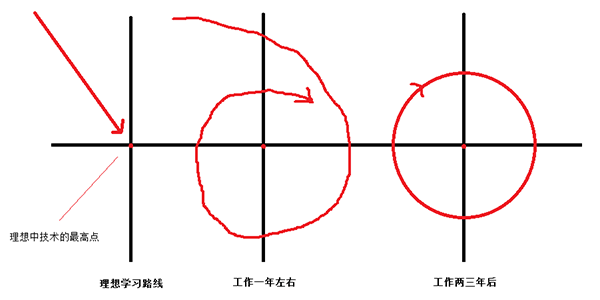
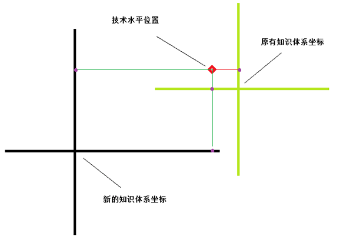

#写给迷茫的我

## 1. 迷茫的自己

两年半时间转瞬即逝，恍然间觉得自己仍然坐在大学的教室里上课，老师那清晰的点名声依然在耳边响起，假若如果时间可以回溯，不知道两年半后的自己是否依然像现在这样，为自己的将来迷茫着……

记得大学刚刚入学，有一堂课叫做职业规划，首先领导上台来bulabula说了一些没有用的官方话语，然后专业老师上台述说专业未来的发展方向，最后说明职业规划的重要性，还有什么职业规划的比赛等等。当然，当时我不以为然，因为我依然记得职业规划比赛得一等奖的家伙貌似毕业混的也不怎么样。

大学期间，为了想开发游戏，毅然从嵌入式转到了游戏开发，回忆起当初更多的是青年热血，而不是沉着思考。毕业后，拒绝了老师推荐的一家安卓开发的工作，转而在一家自己找到的公司上班，工作的内容是用C++开发C/S架构的安防软件，当初拒绝老师的理由现在想起来仍然觉得好笑。自己表面上对老师说是因为java不熟悉，心里却想着开发游戏都用C++，在自己找到的公司既可以学习C++，又可以学习客户端开发，一举两得，两年后转游戏依然不吃亏，并且还多了客户端开发的技能。

想象是完美的，现实是残酷的。两年半过去了，自己现在该何去何从？我不知道。继续做客户端？原有的公司，二线城市，工资不高，想要买房，我觉得基本上下辈子就注定了；换一家一线城市的公司继续做客户端？说好的游戏开发呢，当时梦想呢？我有些迷茫；转做游戏？别逗了，先不说加班加死人，并且也没有这方面的经验，不错，学校是学过，但是时间的流逝可以泯灭很多东西，而且在原有的公司工资不高，但是基本没有加班，还带几个人做项目，日子过得有滋有味，我真的有勇气打破现有的平衡么？

尝试面试游戏开发的时候，面试官顺口提到两三年的迷茫期，不正是说我呢么！迷茫中带着疑问上网查找一些这方面的资料，发现工作两三年迷茫的并不只是自己，自己并不孤独。忽然间回忆大学到现在的日子，也许一切都是命中注定的。大学入学的那堂职业规划课注定了毕业后的我，而毕业后的我注定了现在的我，而现在的我将怎样去改变未来的我？？？也许应该是寻找自己未来出路的时候了。

## 2. 我要怎样去做

我该怎样做？我再次毅然决定离职去广州，找一份游戏开发的工作。四月份辞职，本打算五六月份找工作，在此期间可以好好休息一下，充充电、看看书、敲敲代码，写一些过去想去做的软件，再搞几个Demo去面试。但是辞职之后，结果并不如意。辞职后的前几天，想着刚刚辞职，先放松几天，释放一下连续工作几年的压力。几天后，又觉得还早还早，看看小说、打打游戏、欣赏一下最新的大片，日子过得悠哉悠哉，想要写写代码的心思也慢慢变淡了。

放松，确实是放松了，松的都硬不起来了。想要写一写代码，执行一下辞职前的计划，心有余而力不足啊，人类大脑中的兽性因子始终占领着制高点。偶尔睡前回忆一下辞职后的生活，想象中的计划是那样的苍白无力，内心充满了对自己人生的愧疚，对未来生活的负罪感，对过往生活的消极否定。然后……一觉醒来，恩，涛声依旧了。

现在已经辞职了，我该怎么办？思考很久，既然无力敲代码，还是决定先面试游戏开发试一试。就这样，开始了我在广州的面试之旅。也许这次的面试之旅会使我今后的生活得到改善，亦或一切依旧。

在面试的过程中，一个面试官说话，给我留下很深的印象：“做游戏，技术并不是最重要的，要的是你对游戏的热情，对行业的了解，对游戏的经验，我在你身上看不到一种游戏制作人应有的那种狂热，而这样是对你非常不利的。即使招你进来，做长久的可能性也不大。因为游戏行业竞争压力很大，一般都是6×12工作时间，如果不是真正的热爱游戏是很难坚持下去的。就像女程序员一样，前几年或许看不出差距，但是最后能够留下的总是凤毛麟角！当然我不是否认你的技术水平，但对于你现在的情况，和毕业生是拉不开差距的，这会导致你非常吃亏，并且你除了有C++的开发经验之外，对于游戏开发没有其它可以让人眼前一亮的闪光点。今后我们见面的可能不是很大，我这人比较喜欢实话实话，能给你一些意见的话，尽量会给你指点一下。如果你坚持做游戏，我推荐你今后要在游戏认知方面下工夫，多玩一玩，看一看，并不是让你玩游戏去想游戏怎样实现的，而是希望你真真正正的喜欢上游戏，哪怕只单机游戏，不要到时真要做游戏，跟策划沟通的时候，却不知道策划说的是什么。当然游戏工作仍然是可以找到的，因为现在做游戏的很多，如果你多面，机会仍然是有很多的。”

这次面试后，我扪心自问，是否是真的热爱游戏？我的兴趣是否为游戏开发？答案是否定的。首先我玩的大多是单机游戏，而更多的注重的不是别的，而是放松，是乐趣，过后也就不了了之了。网游？你说的是那种连账号都不用输入，直接登录就可以挂机，一小时能够升级到四五十级的那种么？还是那种手机上你打我一下，我打你一下让人呕吐的rpg？

我发现我回到原点了，原来我对游戏的热爱并不是那样深，之所以做游戏更多的是游戏表达能力强，能够勾引起让人探索的欲望。对游戏开发的热爱貌似更多的是神秘的向往，而不是兴趣使然，我勒个去！我在大学认真想过么？我不知道，一切都貌似已经迟了……

## 3. 职业迷茫期

换工作是否正确？我不知道。这两天不断的了解工作两三年遇见的迷茫期，我发现一个这样的名词：“职业迷茫期”。第一次经历，一般是工作两三年的技术人员。这个时候的技术人员，在专业上有一定的基础，在业务上有一定的经验，处理日常事务小菜一碟，日子过得比较舒服，而一个人最舒服的时候往往也是其成长最慢的时候，对于一个有上进心的技术人员来讲，他感受到的可能就不是舒服了，而是沮丧。这时候的人很浮躁，对工作失去热情，内心“不想混下去”的心思越来越强，接着跳槽之心雄起。槽是跳了，但是结果很有可能是一轮新的循环。

我感觉我就是上面说的那个人。在工作期间的前一年，我的进步像一个弧线，后一年半，更像是一个圆周，在不断的做着过往已将做过的事。

而跳槽更像是坐标系的转换，原有的知识体系中的定位转换到新的知识体系中，位置确实需要待定的，结果往往和想象中的有所差距。

有人说毕业的三五年决定这个人的未来，我觉的有一定的道理，因为你的第一个迷茫期已经过去了，很有可能这个迷茫期就决定着你的未来。工作三年，有人干了三年程序员，而有人却将一年程序员干了三遍。而这往往就是迷茫期所经历的，类似圆周运动的状态。

要打破这种僵局，并不容易，因为打破现有的安逸生活，往往会给自己到造成大量的痛苦，而人类的进化中就是趋向于享受、安逸的生活，这样的冲突是造成自身痛苦的根源。当你冒险试图想要打破现有的环境，你的大脑很有可能会不断的暗示你，现在还不到时候，需要等到时机成熟之后才能行动，而结果很有可能是自己给自己打的麻醉剂，一直就这样等下去，等待幻想中时机的出现。

在现实中，当你觉得一切都不够成熟的时候，也许正是你打破现有僵局的机会，放开手脚去做，去争取，不要在等待，因为你永远不可能等到一切条件成熟的时候。人总是在安逸的时候，忘记过往遭受的痛苦，忘记自己的承诺，自己的梦想。否过来考虑，人只有在遭遇失败、苦难、挫折，甚至到走头无路的时候，才能激发自己的斗志，才能用心去承担责任，才能学到更多的知识、经验，获得更大的进步。

打破自己安逸的生活，我选择了跳槽，这是一种最简单最直接的办法，也是最容易办到的。“大不了重头再来”歌词如是说，大部分人我相信都会如此，因为破而后立、空杯心态，重新开始往往是最容易的。但是这也会带来一些问题，因为很有可能在未来的两三年你仍然会再次进入现在的迷茫期，将来如何做？仍然跳槽，重新开始？如果这样不断的转换知识体系，最后很有可能一事无成。而在相同的知识体系跳转，很有可能仍然会在安逸区的圈子里，那该如何做？

打破僵局的办法很简单，就是深入研究，做到精益求精。不管什么问题，怕的就是“认真”二字，只要认认真真，脚踏实地的专研，必然会在那圆环上开一个口子，打破现有的状态。办法虽然简单，做起来并不容易，精益求精并不是每个人都有耐心去完成的，而这也验证了为什么经常会有人说，最好找工作去找那些自己感兴趣的事情。因为只有自己感兴趣事情，才会更容易做到精益求精，做到勤勤恳恳、脚踏实地，也只有这样才会让你在迷茫期打破僵局的变得更加容易、轻松。

## 4. 感兴趣的事

“感兴趣的事？貌似没有啊！！！”或者“我也不知道对于这件事是否感兴趣？”，这两种答案是经常发生的。认识自己往往是最难的，所以找不到自己感兴趣的事情也就不奇怪了。我问自己：“既然游戏不感兴趣，那你感兴趣的是什么？”，客户端开发？显然不是，那还有别的对工作有帮助的兴趣么？

在找感兴趣的事之前我发现需要避开的第一个陷阱，那就是周围人的关心和帮助。在接受别人对自己关心的时候，很有可能你就被误入歧途，将别人的价值观放到了自己身上。要记住你为自己而活，人比人气死人。你生活的不开心，很有可能是因为你用别人的价值观去衡量你自己的生活，这是一种愚蠢的事情。别人好意的想法和指点很有可能在不知不觉中影响着你。每个人对自己的衡量都是有一定的特殊标准的，有的是金钱；有点是理想；有点是健康。但你要知道，你的人生是你自己的，不要被别人的想法轻易左右。可以听取意见结合自己的自身情况，找准自身的定位，确定自己的价值，不要过度攀比，你未来的人生价值是由你自己谱写。

而第二个陷阱是神秘感，你不知道的事情，往往是你想要了解到。人是有求知欲的，但是不要让这种欲望误导了你，感兴趣的事情不是那些不了解的，而是那些你有了解又很喜欢，有那种深入了解，且痴迷的欲望。

那怎样找到感兴趣的事情？这需要你自己对自己的了解，重审一下你的特长和优点。就是做什么事情比较容易有把握做好，或者说做得比一般人好，找到了后，再去找匹配的工作，找到一个存在的契合点，而这就是你感兴趣的事情。

## 5. 兴趣真的重要吗

找工作相关的兴趣实在是太难了，而更多的兴趣是工作无关的。但是我问自己，兴趣真的重要吗？我觉的应该同样是否定的。《把时间当朋友》这本书里面提到过这个问题，我们也许会觉得自己做的并不是自己感兴趣的事情，但是99%的情况下并非如此。更多的情况是我们没有将当前的事情做好，而没有人喜欢自己做不好的事。每个人都会不可避免的回避自己的短处，唱歌跑调的人不喜欢去ktv；牌技差的不愿意打牌；不善交流的人通常不喜欢人多的场所……我们不对这件事感兴趣会不会是因为自己没有将这件是请做好？要是真没有做好而不感兴趣，那就是另一回事了：做好这件事情对自己有什么具体意义？如果有，那别无选择，只有努力做好为止。

反过来看，自己做的很好，但就是不喜欢，纯粹是那件事对自己没有意义——事实上这样的情况少之又少，这时候当然可以换件事做，但是谁又有能力去逼你去做一件你确实不喜欢做的事情呢？如果真的是被逼迫的，去做自己能够做好的事情，能有多讨厌呢？

人们总是说他们真正感兴趣的是别的事情。事实上，那应该仅仅是因为他们还有没做那件事情，所以还没有在那件事情上遇见挫折，还没有证明那件事情他们做不好，所以，那件事情对他们来讲具备很大的吸引力。事实上，很多人真的放弃自己原来做的事情，然后去做新的、所谓的真正感兴趣的事，他们最终会发现，这件事情要做好同样困难重重，挫折不断。没过多久，这些人就因为做不好而失去兴趣，然后开始幻想做另外的事情，并且“合理化”之后的说法是：“我真正感兴趣的不是这个……”。

所以，兴趣并不是很重要，只有一件事情做好，并且做的比谁都好，或者比大多数人好，你就没办法不对那件事情感兴趣。如果你现在有一件非常擅长，并且做的比其他人都好的事情，那就不要过多的疑惑，继续去专研吧，这就是你感兴趣的事情。假若你没有一项特别擅长的事情，那就不要在白白让时间流逝，直接选好一个方向，努力去做，去专研，因为往往并不是有兴趣才能做好，而是做好了才有兴趣。

## 6. 职业规划

兴趣找到了，或者说知道怎样创造兴趣了，那接下就直接去努力去做么？我想不是，因为我们已经在行业里面工作了两三年了，自身已经对行业应该有个清晰的认识，所以不能再像刚毕业那会，盲目的去做，即使那件事情自己很感兴趣。

是时候做些规划的时候了，并不一定是多么书面板的职业规划，没有人让你去拿它参加什么奖项，只是用它来为你指清方向，不要未来的自己再次迷茫。

对于职业规划，首先要做的是了解自己的方向，或者是自己努力去创造的兴趣的情况。同样的职位在不同公司要求是不同的，我们应该在积累自身技术的同时，多多与同事互相交流，找出自己与别人的差距。要懂得接受比自己优秀的人，在同事中树立起自己的“标杆”，要用自己的短处与别人的长处对比，意识到自己的不足，拿出十二分诚意与标杆做朋友，当标杆和你成为朋友的时候，就近朱者赤，近墨者黑了。

## 7. 不再迷茫

应该是清醒并立即行动的时候了。不过我不知道自己是否能够在树立起职业规划后能够很好的执行，我不知道！不过我会尝试去做，每天都会去写当天的日志，纪录自己的行为，适当的调整，修订自己规划的同时也要争取做到自省吾身。

人最宝贵的是生命，生命对人来说只有一次。一个人的一生应该是这样度过：当他回首往事的时候，不因虚度年华而悔恨，也不因碌碌无为而羞愧。

## 8. 后记

在广州工作三年，最近辞职，整理文章发现自己对一些事物的认知可能加深了，但内心还是那样迷茫，不过每一次的迷茫有些类似，却又有一些不同。如果说前两年在中山是稍微接触，那么在广州的三年算是入门。有幸在公司的平台上可以从头到尾的做一些事情，并且可以随着时间的推移发现其中的变化，不管是工作或者是做人。

我希望下一步自己可以做到：“活在当下！”，不要总是抬头看前面，到最后离自己标越来越远的时候才发现，过去走过的路越来越偏，以至于总是活在对美好未来的畅想和过去痛苦的回忆之间。