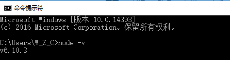
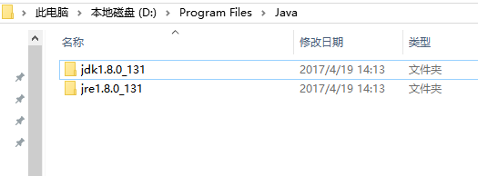
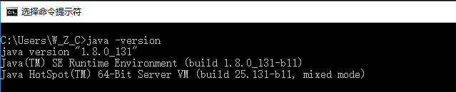
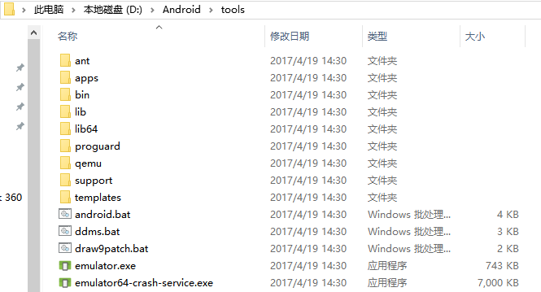
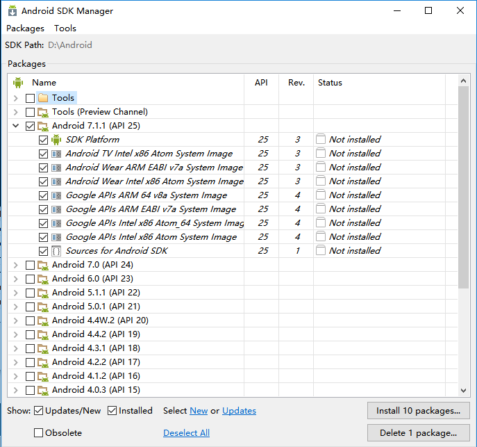
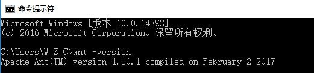

# ionic环境搭建和安装

## 安装nodejs

[官网下载](https://nodejs.org/en/download/)64位nodejs，选择Windows Installer (.msi)版本，目前v6.10.3。默认安装完成后，打开cmd.exe，输入`node -v`确保有信息返回。



*\*如果没有返回正确的版本号，需要设置环境变量，将node的安装目录加到Path里面，具体方法参考附录。*

## 安装JDK

[官网下载](http://www.oracle.com/technetwork/java/javase/downloads/jdk8-downloads-2133151.html)最新版JDK，选择jdk-8u131-windows-x64.exe。该安装包一共会安装两个东西，一个是JDK，一个JRE，全部选择安装，推荐安装到一个目录下：



安装成功后，需要手动设置环境变量：

| 变量名       | 变量值                                |
| --------- | ---------------------------------- |
| JAVA_HOME | D:\Program Files\Java\jdk1.8.0_131 |
| CLASSPATH | .;%JAVA_HOME%\lib\tools.jar        |
|           | *\*变量值可以根据自身安装目录进行调整。*             |

最后为了可以在控制台直接使用调用java程序，需要将java目录加入到PATH环境变量。双击现有的PATH变量，在后面**增加**`%JAVA_HOME%\bin`。*如果是Win10系统，操作更加方便。*

重新打开cmd.exe，输入`java -version`查看是否设置成功。



## 安装Android SDK

因为开发的是Android版本应用，所以需要下载Android SDK，下载地址：[sdk-tools-windows](http://developer.android.com/sdk/index.html )。这里不需要下载Android Studio，只需要下载SDK即可。

下载完成后，解压：



双击android.bat文件，打开Android SDK Manager勾选想要开发平台的api，安装。



安装成功后，在Path环境变量后加入：

```
D:\Android\tools
D:\Android\platform-tools
```

重新打开cmd.exe，输入android回车，如果出现Android SDK Manager软件表示设置成功。

## 安装Apache ant

下载ant，[apache-ant-1.10.1-bin.zip](http://ant.apache.org/bindownload.cgi) 。

解压，增加环境变量：

| 变量名      | 变量值                    |
| -------- | ---------------------- |
| ANT_HOME | D:\apache-ant-1.10.1   |
|          | *\*变量值可以根据自身安装目录进行调整。* |

将文件夹下的lib和bin目录都添加到Path环境变量中。

```
%ANT_HOME%\bin;%ANT_HOME%\lib
```

重新打开cmd.exe，输入ant -verison验证是否设置成功。



## 安装vs2013+

因为ionic项目内部依赖node-sass，而node-sass是基于C++的代码，所以下载node-sass的时候可能会自动编译，如果没有安装vs开发环境，可能会导致安装失败。官方推荐node-sass 0.9.4版本后至少需要安装[Visual Studio 2013 WD](https://www.microsoft.com/en-us/download/details.aspx?id=44914)，如果有多个版本vs开发环境，在安装的时候最好加上`--msvs_version=2013`参数。

*\*本人安装vs2015编译通过。*

## 安装ionic

直接使用npm下载ionic即可。

```
npm install -g ionic cordova
```

## 创建ionic项目

创建一个文件夹：

```sh
md myApp
cd myApp
```

下载模板：

```
ionic start myApp tabs
```

添加平台：

```
ionic cordova platform add android
```

模拟器运行：

```
ionic cordova run android
```

