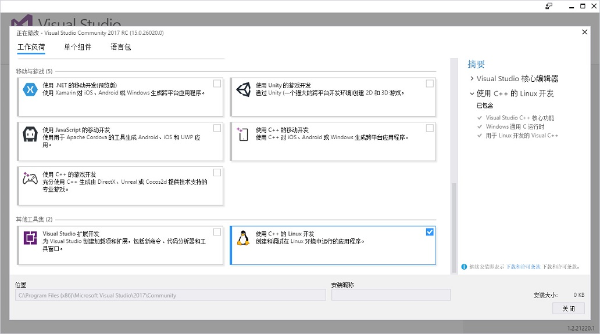
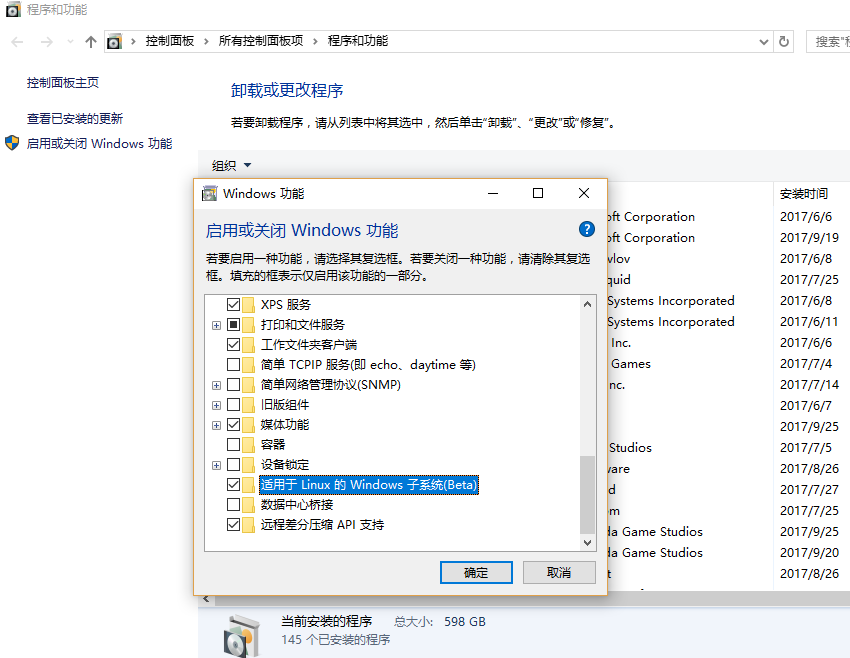
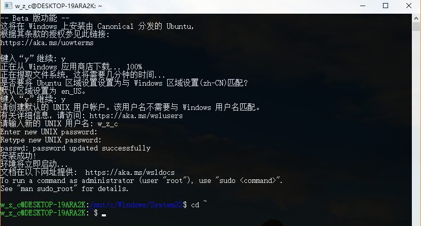
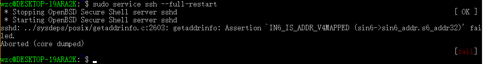
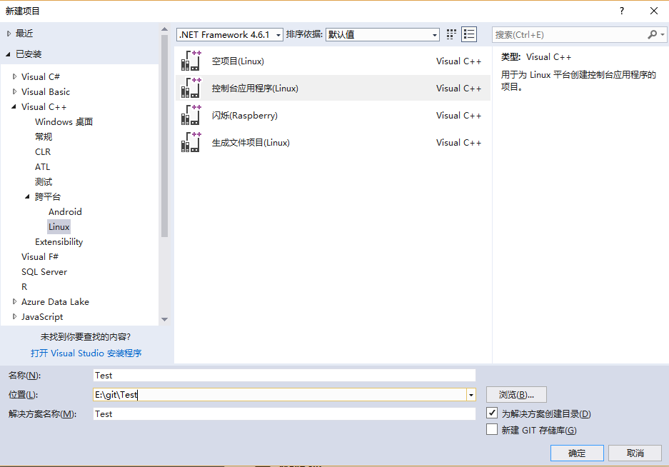
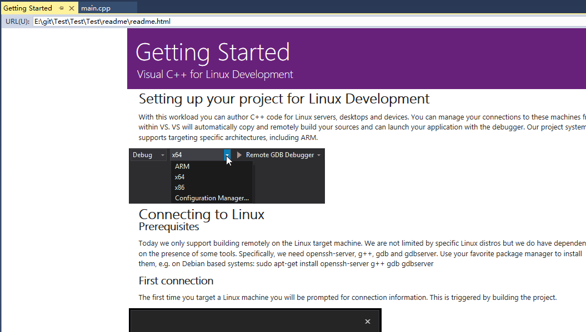
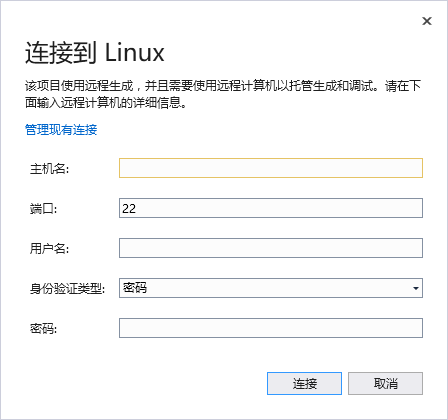
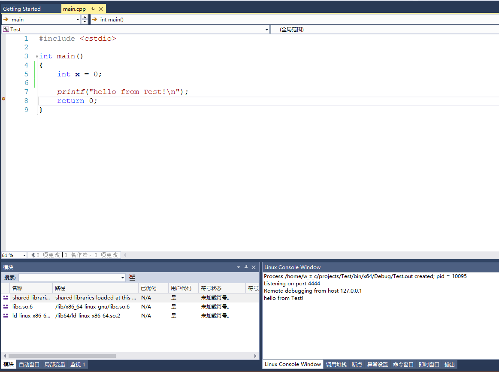

# vs2017调试Linux程序

## 1. 前言

vs2017发布算是一个重大革新，内部支持Linux程序开发，也是微软拥抱开源的又一大动作。vs中Linux开发需要有一个可以运行Linux系统，并且需要安装开发环境和调试环境，真正的编译运行时在Linux系统中运行的。编译的时候，vs会自动将代码复制到目标机器的~/projects/[project-name]目录下，调试的时候说直白的就是gdb的远程调试，方便的地方只是将调试过程整合进IDE调用。



## 2. WSL

WSL是不久前的windows10特性，目前还在Beta版本，是windows下的一个Ubuntu分支，对于vs2017的Linux开发能够提供方便，无需在另行安装虚拟机，因为目前是测试版本，所以可能会出现一些bug。

开启WSL功能，需要进入[程序和功能]模块，点击启动或关闭Windows功能按钮。



开启功能后，其实Linux系统还没有部署安装，需要在命令行中执行`bash`命令安装。



或者：

```
1. Win + X，接着点选或按 A 进入powershell。
2. 安装 WSL：lxrun /install
3. 卸载 WSL：lxrun /uninstall /full
```

## 3. 配置Linux

### 3.1 安装配置

更新源和软件

```
sudo apt-get update
sudo apt-get upgrade
```

重装openssh

```
sudo apt-get remove openssh-server
sudo apt-get install openssh-server
```

打开配置文件

```
sudo vim /etc/ssh/sshd_config
```

设置选项

```
AllowUsers yourusername
PasswordAuthentication=yes
```

重启sshd

```
sudo service ssh --full-restart
```

安装开发套件

```
sudo apt-get install gcc
sudo apt-get install g++
sudo apt-get install gdb
sudo apt-get install gdbserver
```

### 3.2 常见错误

**1.  如果你安装了虚拟机、VPN之类的软件，启动的时候可能会导致sshd错误。**

```
 * Stopping OpenBSD Secure Shell server sshd                                                  [ OK ]
 * Starting OpenBSD Secure Shell server sshd                                                         sshd: ../sysdeps/posix/getaddrinfo.c:2603: getaddrinfo: Assertion `IN6_IS_ADDR_V4MAPPED (sin6->sin6_addr.s6_addr32)' failed.
Aborted (core dumped)
                                                                                              [fail]
```

结果如下图：



解决方法只需在sshd_config文件添加一个ListenAddress 0.0.0.0配置项即可。

参考这个：[sshd fail because getaddrinfo](https://github.com/Microsoft/BashOnWindows/issues/1113)

**2.  除了上面的错误，还可能会发生启动正常，确没法访问的错误。**

发生错误后，查看windows下是22端口是否打开：

```
C:\>netstat -a -q -n | findstr ":22"
  TCP    0.0.0.0:22             0.0.0.0:0              BOUND
```

结果显示绑定成功，却没有正常监听。查找各种解决方案，发现第三方软件导致的，国内的可能是腾讯TGP游戏平台，卸载后重启电脑。

参考这个：[Unable to open any PORT in bash](https://github.com/Microsoft/BashOnWindows/issues/1554)

然后重新打开bash，启动ssh（关闭bash相当于关闭linux）。在windows下查看：

```
C:\>netstat -a -q -n | findstr ":22"
  TCP    0.0.0.0:22             0.0.0.0:0              LISTENING
```

圆满解决。使用ssh可以正常访问WSL了。

## 4. 创建项目

打开vs2017，新建控制台程序。



首次创建工程，会有一个详细的readme帮助文档。



点击运行按钮，弹出Linux配置选项。



默认没有任何输出，需要打开[调试]->[Liunx控制台窗口]查看信息。



简单的程序目前应该没有问题，至于复杂的或者界面程序还没有测试过。并且WSL目前只支持64位系统，如果真的需要在vs2017中开发Liunx程序，WSL或许不是一个很好的选择。
