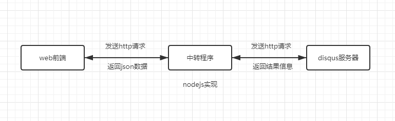
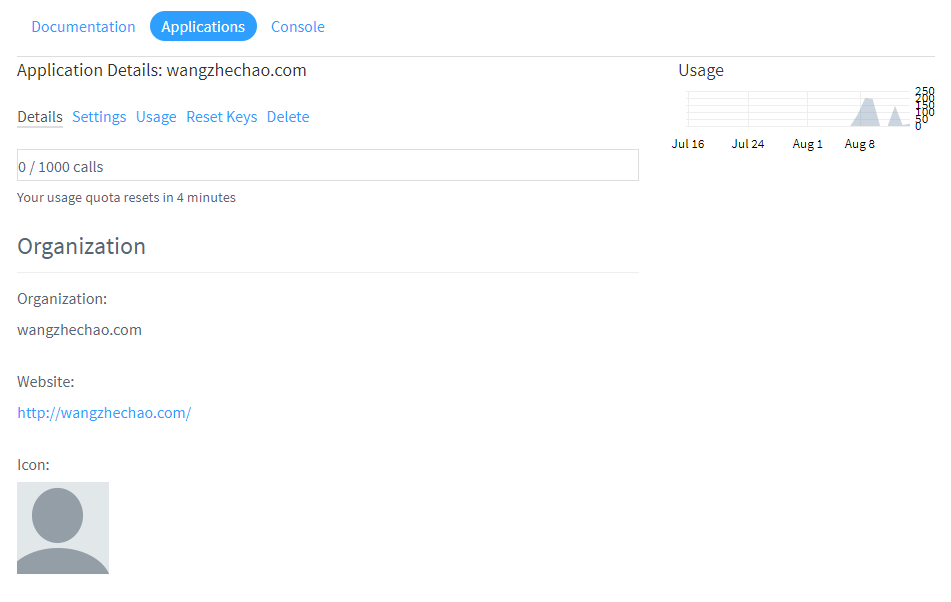

# 国内加载disqus评论的方法

##1.  前言

国内加载disqus评论系统一直都不太稳定，总是出现加载失败无法打开的尴尬局面，最近重新安装了ghost博客，默认主题是含有disqus评论系统，需要自己手动修改代码才能实现，不过鉴于国内的情况，产生了代理的想法，百度了一下，发现有不少实现，如：[fooleap](https://github.com/fooleap/disqus-php-api) 和 [ciqulover](https://github.com/ciqulover/disqus-proxy)。前者后台是php，后者功能有点弱，所以自己在他们的基础上重新造了一个轮子，后台使用nodejs，前台使用graphics.js绘制了一个对付用（没办法，前端css/js写的我开始怀疑人生，一开始已经将fooleap的前端嫁接了一个版本，后来因为后台写的有出入，修改起来有点麻烦最后还是放弃了）。

## 2. 原理

一开始我想使用反向代理，简单的实现，后来看了fooleap的方案，发现disqus支持api调用，仔细的研究了一下，基本的评论加载和提交还是比较容易实现的。初次研究，主要的难点在于disqus评论系统的相关概念需要搞清楚，特别是对于评论系统没有任何研究的我来说。

在disqus系统中，每个网站对应一个`forum`（对应网站主体），每个`forum`有很多`thread`（对应博客文章），每个`thread`包含多个`post`（对应博客的单个评论）。

搞清楚这三个概念，在理解disqus相关的文档基本上没有什么困难，除了有一些api调用起来确实感觉有些出入。（如匿名评论的发表）

了解相关API的调用方法后，需要一台可以访问disqus的服务器用来放置访问disqus API的中转程序，在前端的所有请求都经过该中转程序中转发送到disqus服务器，然后结果再次通过中转程序返回给前端。

具体的情况如下图所示：



##3. 权限

disqus官方使用API的基本套餐是有每小时1000请求的限制的，具体的API请求推荐使用了两种授权协议OAuth2和Single sign-on。在调用Oauth进行相关授权的时候，存在一个scope参数，决定了需要获取的权限，包括read、write、email、admin。这个参数决定了你在未来调用disqus API获取相关数据的结果信息，如果你没有email权限，调用disqus API返回的结果是不会包含email相关参数的。

默认情况下，你可以手动实现OAuth的申请设置，通过设置相关信息可以得到API Key、API Secret、Access Token三个关键参数，在调用相关API的时候需要它们的配合使用。



## 4. 请求和响应

disqus官方文档[Making Requests](https://disqus.com/api/docs/requests/)介绍了如果请求相关API，并获取结果。

###4.1 requests

一个请求包含三个部分：

+ API Version  请求api的版本信息，默认当前3.0
+ Resource path 资源路径
+ Output type 输出类型

正常的访问格式：

```
https://disqus.com/api/{version}/{resource}.{output_type}
```

一个例子：

```
https://disqus.com/api/3.0/forums/listPosts.json?forum=disqus
```

注意：推荐使用SSL

默认，read request =》 GET  ，write request =》 POST

每个请求都需要附加一些参数，如果使用JavaScript API，需要发送`api_key`，如果使用server-side API，需要发送`api_secret`。

关于输出格式，目前Disqus仅仅支持JSON数据类型输出，但是支持JSONP的请求格式，例如：

```
https://disqus.com/api/3.0/trends/listThreads.json?api_key=API_PUBLIC_KEY_HERE&callback=foo
```

关于请求参数，有几个注意事项。

第一，关于多值参数（multi value）。Disqus支持“数组参数”，目前有两种传输方式：

+ `param=foo&param=bar` (首选)
+ `param[]=foo&param[]=bar`

第二，关于查询类型（query types）。Disqus支持“对象参数”，目前可以使用如下方式：

+ `user:username=foobar`

代表请求用户名为foobar的用户。

###4.2 responses

一个响应包含三个部分：

+ HTTP status code  HTTP状态码
+ API status `code` API状态码
+ API response message API响应消息

```json
$ curl -0 -L "https://disqus.com/api/3.0/trends/listThreads.json?api_key=API_PUBLIC_KEY_HERE"
{
  "code": 0,
  "response": [
    {
      "thread": {
        "forum": {
          "id": "cucirca",
          "name": "Tv Shows",
          "founder": 996907,
          "favicon": {
            "permalink": "https://disqus.com/api/forums/favicons/cucirca.jpg",
            "cache": "https://a.disquscdn.com/uploads/forums/20/8466/favicon.png"
          }
        },
        "author": 996907,
        "title": "Watch True Blood Online",
        "link": "http://www.cucirca.com/2009/05/27/watch-true-blood-online/",
        "closed": false,
        "id": 40385200,
        "createdAt": "2009-10-19T04:51:26"
      },
      "comments": 14605,
      "score": "2.9408284023668639",
      "link": "http://www.cucirca.com/2009/05/27/watch-true-blood-online/",
      "likes": 62,
      "commentLikes": 9884
    }
  ]
}
```
## 5. 后记

通过研究disqus的API文档，大概的了解了评论系统的基本结构，尝试并实现了一个简单评论系统的前后台，目前评论系统只实现了简单的读取和提交操作，以后会进一步，看看是否实现点赞、标注、推荐等其它相关内容。