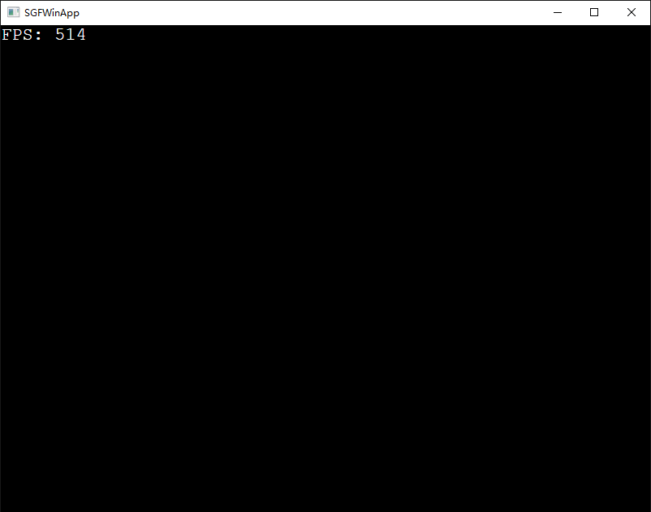

# 如何搭建一个游戏框架

## 1. 前言

本文主要的内容是介绍如何在windows操作系统上搭建一个Win32窗口，并抽象出一套简单的渲染引擎接口，文章中使用的绘图接口为Direct2D，当然如果在学习本文后，完全可以使用GDI来重新实现渲染引擎。

为了按照本文的讲解进行操作，你需要使用vs2017创建一个Win32的空项目，具体的文件可以自行创建，或者直接从github上下载编辑。

文章包含以下几个部分：

1. 创建窗口类。
2. 定义渲染引擎接口。
3. 实现Direct2D渲染引擎。

程序运行结果如下：



## 2. 创建窗口类

创建窗口其实已经是老生常谈，网上搜索资料一搜一大把。Win32窗口的创建过程包括注册窗口类、创建窗口和消息循环三个步骤，这里将这三个步骤封装成为WinApp的成员函数。

首先创建头文件，声明窗口类WinApp。

```C++
class WinApp
{
public:
	WinApp(HINSTANCE);
	~WinApp();

public:       
	int Initialize(Render* render);
	void Run();


private:
	int RegisterClassAndCreateWindow();
	static LRESULT CALLBACK WndProc(HWND hWnd, UINT message, WPARAM wParam, LPARAM lParam);


private:
	Render* m_pRender;
	HINSTANCE m_hInstance;
	HWND m_hWnd;
};
```

类WinApp中包含两个对外的公有成员函数Initialize和Run，其中函数Initialize主要负责注册窗口类和创建窗口，参数是一个Render类指针，负责程序的渲染部分。函数Run负责消息循环，处理及调用Render类的成员函数，实现程序内容的实时渲染。

Initialize函数内部间接调用私有成员函数RegisterClassAndCreateWindow。

```C++
//注册窗口类，创建窗口
int WinApp::RegisterClassAndCreateWindow()
{
	//定义填充窗口 
	WNDCLASSEX wcex;

	...

	//注册窗口类 
	if (!RegisterClassEx(&wcex))
	{
		return ERR_REGISTER_CLASS_FAIL;
	}

	...

	//创建窗口
	if (!(m_hWnd = CreateWindowEx(m_dwExStyle, APP_CLASS_NAME, APP_WIN_NAME, m_dwStyle,
		(SCREEN_WIDTH - WIN_WIDTH) / 2, (SCREEN_HEIGHT - WIN_HEIGHT) / 2, 
		WIN_WIDTH, WIN_HEIGHT, NULL, NULL, m_hInstance, this)))
	{
		UnregisterClass(APP_CLASS_NAME, m_hInstance);

		return ERR_CREATE_WIN_FAIL;
	}


	//显示更新窗口 
	ShowWindow(m_hWnd, SW_SHOWNORMAL);
	UpdateWindow(m_hWnd);

	return ERR_NONE;
}
```

函数Run内部是调用PeekMessage进行消息处理的while循环，适合游戏程序使用，如果单纯的写应用程序，应该使用GetMessage。

```C++
while (!bQuit)
{
	//获取消息
	if (PeekMessage(&nMsg, NULL, 0, 0, PM_REMOVE))
	{
		if (nMsg.message == WM_QUIT)
		{
			bQuit = true;
		}
		else
		{
			TranslateMessage(&nMsg);
			DispatchMessage(&nMsg);
		}
	}
	else
	{
		QueryPerformanceCounter(&nCurrTime);
		nElapsedCounter.QuadPart = nCurrTime.QuadPart - nPrevTime.QuadPart;
		nPrevTime.QuadPart = nCurrTime.QuadPart;

		elapsed = nElapsedCounter.QuadPart * 1000.0f / nFrequency.QuadPart;

		//程序激活并且没有主动挂起
		if (m_bActive && (!m_bSuspend))
		{
			if (m_pRender)
				m_pRender->RenderFrame(elapsed);
		}

		//小游戏，降低点cpu
		Sleep(1);
	}
}
```

使用该类十分简单，直接在WinMain函数内调用，既可以创建一个简单的窗口。

```C++
int WINAPI WinMain(HINSTANCE hInstance, HINSTANCE, LPSTR, int)
{
	SGF::WinApp app(hInstance);
	if (app.Initialize(render) == SGF::ERR_NONE)
	{
		app.Run();
	}

	return 0;
}
```

## 3. 定义渲染引擎接口

渲染引擎的接口对于接下来的工作非常重要，因为所有的实现都是对该接口的继承，渲染引擎接口用C++的纯虚函数表示，主要负责以后游戏中的渲染。

```C++
class Render
{
public:
	virtual ~Render() {};

	virtual int Initiate(HWND hwnd) = 0;
	virtual void RenderFrame(float dt) = 0;
	virtual void Uninitiate() = 0;
	virtual void Resize(unsigned int w, unsigned int h) = 0;
	virtual void FocusChange(bool act) = 0;
	virtual void GetDesktopDpi(float* dpiX, float* dpiY) = 0;
};
```

接口Initiate和Uninitiate负责渲染引擎的初始化和反初始化，RenderFrame执行具体的渲染内容。Resize和FocusChange负责当程序的大小发生变化和焦点发生变化的时候该如何处理。GetDesktopDpi负责获取桌面的dpi，主要是为了高分辨屏在创建窗口的时候过小的问题。

## 4. 实现Direct2D渲染引擎

只有接口定义并没有什么作用，具体的渲染工作还是要根据具体图形API，渲染引擎的接口主要是负责定义一组约定，为了以后多个渲染引擎之间切换提供方便。

这里主要介绍一个Direct2D的渲染引擎的实现。定义D2DRender类，该类继承自Render。

```C++
class D2DRender : public Render
{
public:
	D2DRender();
	virtual ~D2DRender();

public:
	virtual int Initiate(HWND hwnd);
	virtual void RenderFrame(float dt);
	virtual void Uninitiate();
	virtual void Resize(unsigned int w, unsigned int h);
	virtual void FocusChange(bool act);
	virtual void GetDesktopDpi(float* dpiX, float* dpiY);
	
	...
};
```

现代图形API大多数都支持硬件加速，主要是使用GPU来完成原来CPU的工作，但是因为GPU存在一定的限制，所以并不是所有的工作都是在GPU上完成，更多的是只能将一部分工作转移到GPU完成，而这个过程需要区分管理哪些资源可以加速，如何加速的问题，这些表面上看似简单，其实内部需要很多取舍，特别是在GPU和CPU之间切换时需要一定的代价的。

 Direct2D为了更充分的利用GPU，将所有资源分为与设备无关的资源和设备有关的资源。

+ 与设备无关的资源（如ID2D1Geometry）保留在CPU上。
+ 与设备有关的资源（如ID2D1RenderTarget）直接映射到GPU上的资源。

这些资源会在创建的时候分配好，不会在显示的时候进行转换更改，所以无需资源管理等操作得以获得一部分的性能优势。

为了方便创建，D2DRender分为两组资源创建过程，一部分负责设备无关的资源创建和销毁工作：

```C++
HRESULT CreateDeviceIndependentResources();
void DiscardDeviceIndependentResources();
```

另一部分负责资源相关的创建和销毁工作：

```C++
HRESULT CreateDeviceResources();
void DiscardDeviceResources();
```

在D2DRender的构造函数中调用资源无关的创建函数，而资源有关的函数因为需要获取窗口相关操作，所以具体在Initiate中完成。

其中CreateDeviceIndependentResources代码如下，主要负责渲染和文本的工厂渲染指针的创建工作：

```C++
HRESULT D2DRender::CreateDeviceIndependentResources()
{
	HRESULT hr = S_OK;

	if(!m_pDirect2dFactory)
		hr = D2D1CreateFactory(D2D1_FACTORY_TYPE_SINGLE_THREADED, &m_pDirect2dFactory);


	if (m_bFPS)
	{
		static const WCHAR msc_fontName[] = L"Courier New";
		static const FLOAT msc_fontSize = 22;

		if (SUCCEEDED(hr) && (!m_pDWriteFactory))
		{
			// Create a DirectWrite factory.
			hr = DWriteCreateFactory(
				DWRITE_FACTORY_TYPE_SHARED,
				__uuidof(m_pDWriteFactory),
				reinterpret_cast<IUnknown **>(&m_pDWriteFactory)
			);


			if (SUCCEEDED(hr) && (!m_pTextFormat))
			{
				// Create a DirectWrite text format object.
				hr = m_pDWriteFactory->CreateTextFormat(
					msc_fontName,
					NULL,
					DWRITE_FONT_WEIGHT_NORMAL,
					DWRITE_FONT_STYLE_NORMAL,
					DWRITE_FONT_STRETCH_NORMAL,
					msc_fontSize,
					L"", //locale
					&m_pTextFormat
				);
			}


			if (SUCCEEDED(hr) && m_pTextFormat)
			{
				// Center the text horizontally and vertically.
				m_pTextFormat->SetTextAlignment(DWRITE_TEXT_ALIGNMENT_LEADING);
				m_pTextFormat->SetParagraphAlignment(DWRITE_PARAGRAPH_ALIGNMENT_NEAR);
			}
		}
	}

	return hr;
}
```

其中CreateDeviceResources代码如下，主要负责渲染目标和相关渲染资源的创建工作：

```
HRESULT D2DRender::CreateDeviceResources()
{
	HRESULT hr = S_OK;

	//如果没有创建设备资源
	if (!m_pRenderTarget)
	{
		RECT rc;
		GetClientRect(m_hWnd, &rc);

		D2D1_SIZE_U size = D2D1::SizeU(
			rc.right - rc.left,
			rc.bottom - rc.top
		);


		if (m_pDirect2dFactory)
		{
			hr = m_pDirect2dFactory->CreateHwndRenderTarget(
				D2D1::RenderTargetProperties(),
				D2D1::HwndRenderTargetProperties(m_hWnd, size, D2D1_PRESENT_OPTIONS_IMMEDIATELY),
				&m_pRenderTarget);
		}


		if (m_bFPS)
		{
			if (SUCCEEDED(hr) && m_pRenderTarget)
			{
				hr = m_pRenderTarget->CreateSolidColorBrush(
					D2D1::ColorF(D2D1::ColorF::White),
					&m_pBlackBrush);
			}
		}
	}

	return hr;
}
```

函数RenderFrame主要是负责绘制渲染内容，其中的具体工作是由渲染目标指针m_pRenderTarget完成的，所有的绘制工作都是在BeginDraw和EndDraw函数间执行。

```C++
m_pRenderTarget->BeginDraw();

...

hr = m_pRenderTarget->EndDraw();
```

在程序中可能会存在设备丢失的情况，例如：

+ 程序在全屏状态下失去键盘焦点。
+ 其他程序进入全屏状态。
+ 电源管理事件，例如屏保等。

在程序中通过EndDraw函数的返回值来进行判断，如果设备丢失需要重新调用CreateDeviceResources函数创建资源，这也是为什么很多游戏在切换的时候很卡的原因。

## 5. 总结

本篇文章只是简单介绍一下游戏框架（SGF Simple Graphics Frame）的搭建过程，主要是为了以后游戏开发工作打下基础，具体代码可以通过github下载学习。